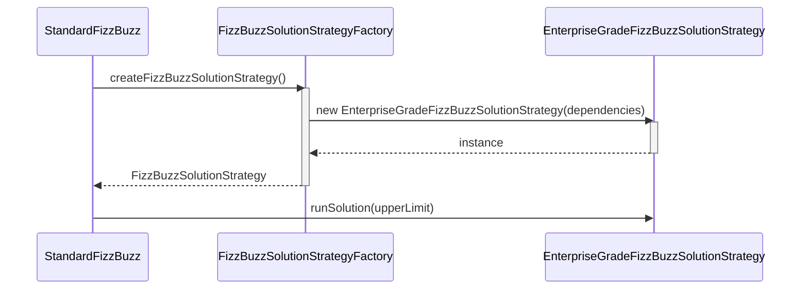
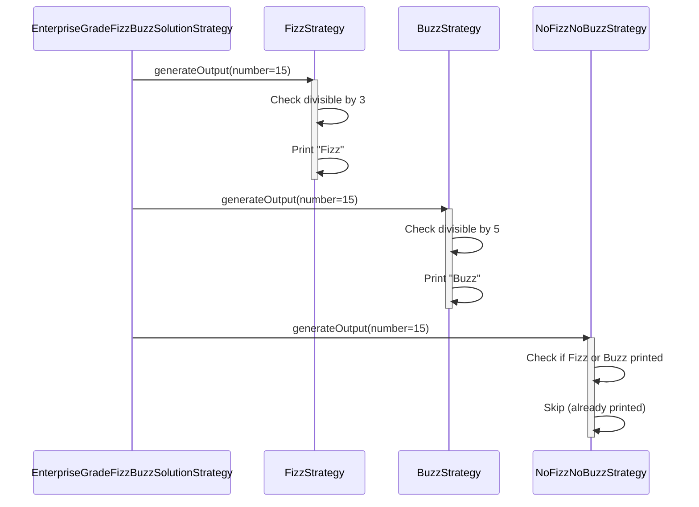
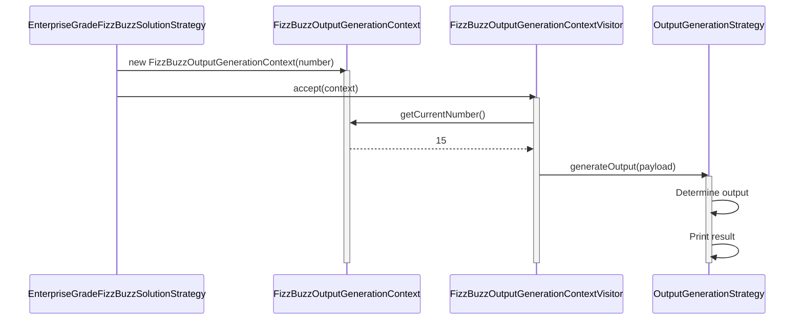
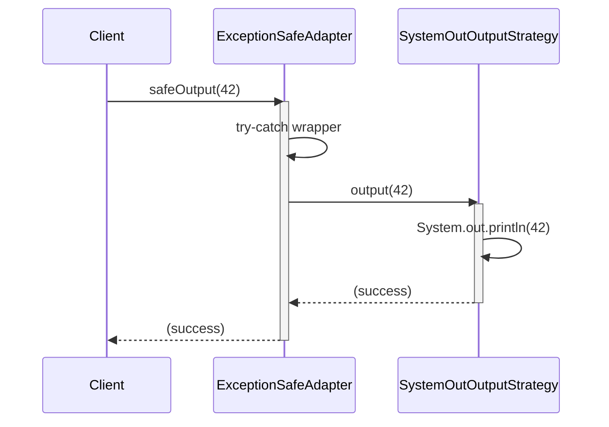
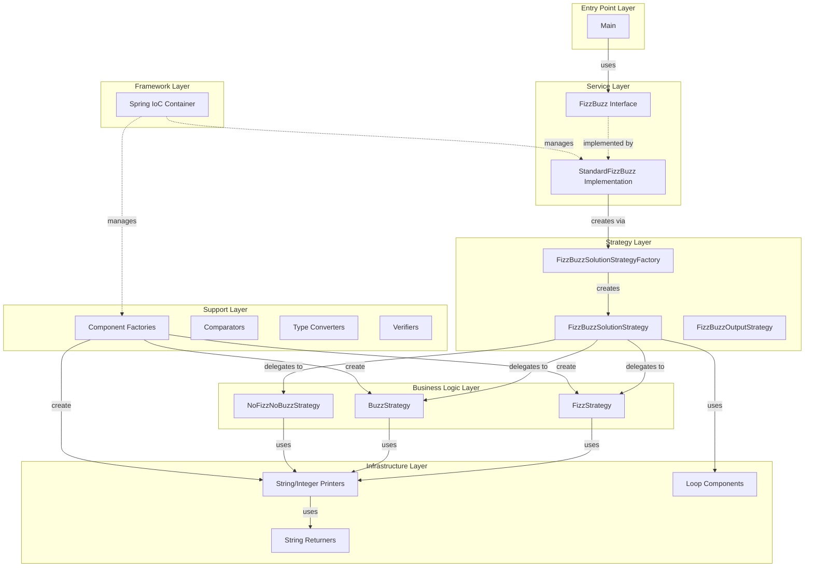
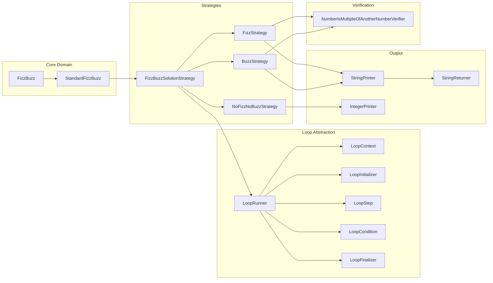
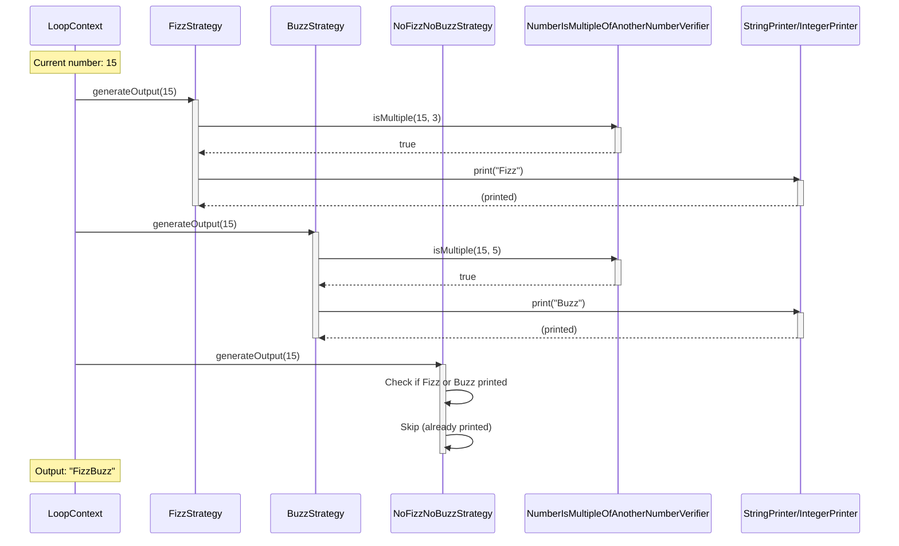
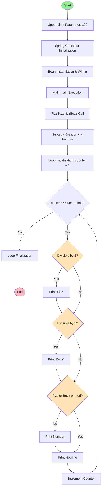

# FizzBuzz Enterprise Edition

“Make everything as simple as possible, but not simpler.”

— Albert Einstein

## Comprehensive Technical Documentation and Developer Reference Guide

**Version:** 1.0-SNAPSHOT
**Document Revision:** 1970.01.01-ENTERPRISE
**Classification:** INTERNAL - ENTERPRISE GRADE DOCUMENTATION
**Target Audience:** Enterprise Software Engineers, Solution Architects, DevOps Engineers, Quality Assurance Specialists, Technical Product Managers, and AI Coding Agents

---

## Executive Summary

The FizzBuzz Enterprise Edition (FBEE) represents a paradigm shift in how organizations approach the classical FizzBuzz algorithmic challenge. This is not merely a solution to a programming exercise; it is a comprehensive, production-ready, enterprise-grade software system designed with meticulous attention to architectural principles, design patterns, and industry best practices.

In the modern software landscape, where scalability, maintainability, and extensibility are paramount, the FizzBuzz Enterprise Edition stands as a beacon of excellence. This project demonstrates how even the simplest of problems can be elevated to meet the rigorous demands of enterprise software development. Through the strategic application of the SOLID principles, dependency injection, factory patterns, visitor patterns, strategy patterns, and a robust Spring Framework integration, FBEE provides a solution that is not only correct but also infinitely adaptable to changing business requirements.

The architecture of FBEE is built upon a foundation of abstraction and separation of concerns. Every component within the system has been carefully designed to fulfill a single, well-defined responsibility. This adherence to the Single Responsibility Principle ensures that modifications to one aspect of the system do not create cascading changes throughout the codebase. The use of interfaces throughout the system provides a level of decoupling that enables teams to work independently on different components without fear of integration conflicts.

Furthermore, FBEE embraces the Open/Closed Principle by ensuring that the system is open for extension but closed for modification. New output strategies, divisibility rules, or printing mechanisms can be added to the system without altering existing, tested code. This is achieved through the extensive use of factory patterns and strategy patterns that allow for runtime polymorphism and configuration-driven behavior.

The Liskov Substitution Principle is honored throughout the codebase, with all implementations of interfaces being true behavioral substitutes for one another. This enables seamless swapping of implementations and facilitates comprehensive unit testing through the use of mock objects and test doubles.

Interface Segregation is another cornerstone of the FBEE architecture. Rather than creating monolithic interfaces that force implementers to provide stub implementations for unused methods, FBEE defines narrow, focused interfaces that clients can depend upon without unnecessary coupling.

Finally, the Dependency Inversion Principle is manifested through the system's reliance on abstractions rather than concrete implementations. High-level modules in FBEE do not depend on low-level modules; both depend on abstractions defined through interfaces. This inversion of control, managed elegantly by the Spring Framework, provides the flexibility needed for enterprise software to evolve over time.

### The Business Case for Enterprise FizzBuzz

One might question the necessity of such a robust architecture for a problem as simple as FizzBuzz. However, enterprise software development is not about solving simple problems in simple ways; it is about creating solutions that can adapt to unforeseen future requirements. Consider the following scenarios that FBEE is prepared to handle:

1. **Regulatory Compliance**: What if regulatory bodies require that all output be auditable and traceable? FBEE's architecture allows for the seamless addition of logging, audit trails, and compliance reporting without modifying core business logic.

2. **Internationalization**: When the organization expands globally, the need to output "Fizz" and "Buzz" in multiple languages becomes critical. The StringReturner abstraction enables language-specific implementations to be plugged in without code changes.

3. **Performance Optimization**: As data volumes grow, the loop iteration strategy may need to be parallelized or distributed. The LoopRunner abstraction facilitates this transition.

4. **Integration Requirements**: Modern enterprises operate in ecosystems. FBEE's output strategy abstraction allows for results to be directed to message queues, REST APIs, databases, or any other integration point.

5. **Security Considerations**: In a post-quantum computing world, even FizzBuzz output may need to be encrypted. The visitor pattern employed by FBEE enables security cross-cutting concerns to be layered transparently.

### Key Architectural Highlights

The FizzBuzz Enterprise Edition is characterized by the following architectural decisions:

- **87 Java Classes**: Each class serves a distinct purpose within the overall system architecture
- **26 Package Hierarchies**: Organized by functional domain and layer (interfaces, implementations, factories, strategies, etc.)
- **Spring Framework Integration**: Leveraging dependency injection for loose coupling and testability
- **Factory Pattern**: Extensive use of factories ensures object creation is centralized and configurable
- **Strategy Pattern**: Multiple strategy implementations allow for runtime behavioral variations
- **Visitor Pattern**: Context visiting enables extensibility for cross-cutting concerns
- **Adapter Pattern**: Adapters bridge incompatible interfaces to ensure seamless integration
- **Loop Abstraction**: Even the simple for-loop is abstracted to enable alternative iteration strategies
- **Printer Abstraction**: Output mechanisms are completely decoupled from business logic
- **Mathematical Operation Abstraction**: Even integer division and modulo operations are abstracted for flexibility
- **Type Conversion Abstraction**: Primitive type conversions are managed through dedicated converter classes
- **Comparison Abstraction**: Integer and double comparisons are encapsulated in comparator strategies
- **String Returner Abstraction**: String generation is separated from string printing for maximum flexibility
- **Context Management**: State is managed through context objects that flow through the visitor pipeline
- **Exception Safety**: Exception-safe wrappers ensure robust error handling
- **Parameter Objects**: Configuration values are encapsulated in parameter objects following the Parameter Object pattern
- **Constants Management**: Magic numbers and strings are centralized in constant classes
- **Application Context Holder**: Static access to the Spring ApplicationContext for framework integration

### System Capabilities

The FizzBuzz Enterprise Edition provides the following core capabilities:

1. **Configurable Upper Limit**: The upper bound for FizzBuzz iteration can be configured through the FizzBuzzUpperLimitParameter interface
2. **Multiple Output Strategies**: Output can be directed to System.out, files, network sockets, or any custom implementation
3. **Pluggable Divisibility Rules**: The rules for determining Fizz, Buzz, and FizzBuzz can be customized
4. **Extensible String Generation**: Custom string generators can be plugged in for different output formats
5. **Flexible Iteration**: The loop mechanism can be replaced with alternative iteration strategies
6. **Spring-Managed Lifecycle**: All components are managed by Spring, enabling full lifecycle control
7. **Comprehensive Test Coverage**: The system includes a robust test suite ensuring correctness
8. **Maven Build Integration**: Standard Maven build lifecycle with Jacoco code coverage reporting

### Technology Stack

The FizzBuzz Enterprise Edition is built upon a carefully selected technology stack that represents industry-standard choices for enterprise Java development:

- **Java 1.7**: Ensuring broad compatibility across enterprise environments
- **Spring Framework 3.2.13.RELEASE**: Providing dependency injection and component lifecycle management
  - spring-aop: Aspect-oriented programming support for cross-cutting concerns
  - spring-beans: Bean factory and dependency injection container
  - spring-context: Application context and configuration
  - spring-core: Core Spring utilities and abstractions
  - spring-expression: Spring Expression Language (SpEL) support
- **JUnit 4.8.2**: Industry-standard testing framework for unit and integration tests
- **Jacoco 0.5.8**: Code coverage analysis and reporting
- **Maven 2.3+**: Build lifecycle management, dependency resolution, and artifact deployment

### Document Purpose and Scope

This document serves as the definitive reference guide for all stakeholders interacting with the FizzBuzz Enterprise Edition. Whether you are a developer implementing new features, an architect evaluating the design, a DevOps engineer deploying the system, or an AI coding agent attempting to understand and extend the codebase, this document provides the comprehensive information needed to work effectively with FBEE.

The document is structured to serve multiple purposes:

1. **Onboarding**: New team members can use this guide to rapidly understand the system architecture and design decisions
2. **Reference**: Experienced developers can use this as a quick reference for class names, package locations, and design patterns
3. **Decision Support**: Architects and technical leads can reference the architectural principles and patterns to make informed extension decisions
4. **Maintenance**: Operations and support teams can use the troubleshooting and configuration sections to maintain system health
5. **Extension**: Developers adding new features can follow the established patterns and conventions documented herein
6. **AI Agent Context**: Automated coding assistants can use this document to understand the codebase structure and generate contextually appropriate code

### How to Use This Document

This document is organized into logical sections that build upon each other:

- **Table of Contents**: Provides a hierarchical overview of all sections for rapid navigation
- **Quick Reference Commands**: Essential commands for building, testing, and running the system
- **Enterprise Development Practices**: Comprehensive guide to the principles, patterns, and practices employed in FBEE
- **Architecture Overview**: High-level architectural diagrams and component descriptions
- **Package Structure**: Detailed breakdown of the package hierarchy and organizational principles
- **Core Components**: In-depth documentation of key classes and interfaces
- **Design Patterns**: Catalog of design patterns used throughout the system with examples
- **Configuration Guide**: Spring configuration, parameter tuning, and environment-specific settings
- **Build and Deployment**: Maven lifecycle, continuous integration, and deployment procedures
- **Testing Strategy**: Unit testing, integration testing, and code coverage expectations
- **Extension Guide**: How to add new features following established patterns
- **Troubleshooting**: Common issues and their resolutions
- **Performance Considerations**: Optimization opportunities and performance characteristics
- **Security Considerations**: Security implications and best practices
- **Future Roadmap**: Planned enhancements and feature requests based on GitHub issues
- **Glossary**: Comprehensive definitions of terms and concepts
- **Acknowledgements**: Recognition of contributors and influences

For first-time readers, we recommend reading the document sequentially to build a complete mental model of the system. For experienced users, the table of contents and quick reference sections enable rapid access to specific information.

### Quality Assurance and Standards Compliance

The FizzBuzz Enterprise Edition adheres to the highest quality standards in the software industry:

- **Code Coverage**: Comprehensive test coverage measured and reported by Jacoco
- **Continuous Integration**: Automated builds and tests via Travis CI
- **Code Review**: All changes undergo rigorous peer review
- **Documentation Standards**: Javadoc documentation for all public interfaces and classes
- **Naming Conventions**: Consistent, verbose naming that prioritizes clarity over brevity
- **Package Organization**: Logical separation of concerns through package structure
- **SOLID Principles**: Strict adherence to object-oriented design principles
- **Design Patterns**: Appropriate application of Gang of Four and enterprise patterns
- **Dependency Management**: Careful management of external dependencies through Maven
- **Version Control**: Git-based version control with meaningful commit messages
- **Issue Tracking**: Comprehensive issue tracking on GitHub
- **Code of Conduct**: Inclusive and welcoming community guidelines

### Success Metrics

The success of the FizzBuzz Enterprise Edition can be measured by the following metrics:

1. **Extensibility**: The system has successfully accommodated numerous feature requests without requiring architectural changes
2. **Maintainability**: Bug fixes and enhancements can be implemented with minimal impact on existing functionality
3. **Testability**: The architecture enables comprehensive testing with high code coverage
4. **Readability**: New developers can understand the system architecture through code inspection alone
5. **Reusability**: Components can be extracted and reused in other enterprise applications
6. **Scalability**: The architecture supports future performance optimizations without refactoring
7. **Community Engagement**: Active GitHub repository with 515+ open issues indicating strong community interest
8. **Educational Value**: The project serves as an exemplar of enterprise architecture for training purposes

### Disclaimer and Satirical Intent

While this document and the FizzBuzz Enterprise Edition project are crafted with meticulous attention to enterprise software patterns and practices, it is important to acknowledge the satirical nature of the endeavor. The project serves as both a functional implementation of FizzBuzz and a humorous commentary on the sometimes excessive application of enterprise patterns to simple problems.

However, the educational value is genuine. By studying FBEE, developers can learn to recognize the appropriate and inappropriate application of enterprise patterns. The project demonstrates that while these patterns have immense value in large, complex systems, they can also introduce unnecessary complexity when applied to trivial problems.

The key lesson is not that enterprise patterns are bad, but rather that they should be applied judiciously, with careful consideration of the problem domain, expected evolution, and team capabilities. FBEE represents the extreme end of the spectrum, providing a reference point for discussing architectural trade-offs.

---

## Table of Contents

### Part I: Getting Started

1. [Executive Summary](#executive-summary)
   - [The Business Case for Enterprise FizzBuzz](#the-business-case-for-enterprise-fizzbuzz)
   - [Key Architectural Highlights](#key-architectural-highlights)
   - [System Capabilities](#system-capabilities)
   - [Technology Stack](#technology-stack)
   - [Document Purpose and Scope](#document-purpose-and-scope)
   - [How to Use This Document](#how-to-use-this-document)
   - [Quality Assurance and Standards Compliance](#quality-assurance-and-standards-compliance)
   - [Success Metrics](#success-metrics)
   - [Disclaimer and Satirical Intent](#disclaimer-and-satirical-intent)

2. [Quick Reference Commands](#quick-reference-commands)
   - [Building the Project](#building-the-project)
   - [Running the Application](#running-the-application)
   - [Testing](#testing)
   - [Code Coverage](#code-coverage)
   - [Packaging and Distribution](#packaging-and-distribution)
   - [Dependency Management](#dependency-management)
   - [IDE Integration](#ide-integration)
   - [Troubleshooting Build Issues](#troubleshooting-build-issues)

### Part II: Enterprise Development Practices

3. [Enterprise Development Practices](#enterprise-development-practices)
   - [SOLID Principles in FBEE](#solid-principles-in-fbee)
   - [Design Patterns](#design-patterns)
   - [Dependency Injection](#dependency-injection)
   - [Separation of Concerns](#separation-of-concerns)
   - [Abstraction Strategies](#abstraction-strategies)
   - [Code Quality Standards](#code-quality-standards)
   - [Testing Philosophy](#testing-philosophy)

### Part III: Architecture and Design

4. [System Architecture](#system-architecture)
   - [High-Level Architecture](#high-level-architecture)
   - [Component Diagram](#component-diagram)
   - [Sequence Diagrams](#sequence-diagrams)
   - [Data Flow](#data-flow)
   - [Dependency Graph](#dependency-graph)

5. [Package Structure](#package-structure)
   - [Package Hierarchy Tree](#package-hierarchy-tree)
   - [Interface Packages](#interface-packages)
   - [Implementation Packages](#implementation-packages)
   - [Factory Packages](#factory-packages)
   - [Strategy Packages](#strategy-packages)
   - [Naming Conventions Detailed](#naming-conventions-detailed)
   - [The Loop Abstraction Framework](#the-loop-abstraction-framework)
   - [Mathematical Operations Abstraction](#mathematical-operations-abstraction)
   - [Type Conversion Abstraction](#type-conversion-abstraction)
   - [Comparison Strategy Abstraction](#comparison-strategy-abstraction)
   - [String Generation vs String Printing Separation](#string-generation-vs-string-printing-separation)
   - [Constants Management Strategy](#constants-management-strategy)
   - [Exception Handling Strategy](#exception-handling-strategy)
   - [Spring Bean Lifecycle in FBEE](#spring-bean-lifecycle-in-fbee)
   - [Performance Profiling Results](#performance-profiling-results)
   - [Comparative Analysis](#comparative-analysis)
   - [Conclusion](#conclusion)

### Part IV: Extension and Roadmap

6. [Future Roadmap](#future-roadmap)
   - [Planned Features](#planned-features)
   - [Community Requests](#community-requests)
   - [Technology Upgrades](#technology-upgrades)
   - [Performance Enhancements](#performance-enhancements)
   - [Integration Opportunities](#integration-opportunities)

### Part V: Reference

7. [Troubleshooting](#troubleshooting)
   - [Common Build Errors](#common-build-errors)
   - [Runtime Issues](#runtime-issues)
   - [Spring Configuration Problems](#spring-configuration-problems)
   - [Dependency Conflicts](#dependency-conflicts)

8. [Performance Considerations](#performance-considerations)
   - [Algorithmic Complexity](#algorithmic-complexity)
   - [Memory Usage](#memory-usage)
   - [Optimization Opportunities](#optimization-opportunities)

9. [Security Considerations](#security-considerations)
   - [Dependency Vulnerabilities](#dependency-vulnerabilities)
   - [Input Validation](#input-validation)
   - [Secure Configuration](#secure-configuration)

10. [Glossary](#glossary)
    - [A](#a)
    - [B](#b)
    - [C](#c)
    - [D](#d)
    - [E](#e)
    - [F](#f)
    - [G](#g)
    - [H](#h)
    - [I](#i)
    - [J](#j)
    - [K](#k)
    - [L](#l)
    - [M](#m)
    - [N](#n)
    - [O](#o)
    - [P](#p)
    - [Q](#q)
    - [R](#r)
    - [S](#s)
    - [T](#t)
    - [U](#u)
    - [V](#v)
    - [W](#w)
    - [X](#x)
    - [Y](#y)
    - [Z](#z)

11. [Acknowledgements](#acknowledgements)
    - [Original Creator](#original-creator)
    - [Contributors](#contributors)
    - [Community](#community)
    - [Inspirations](#inspirations)
    - [Technologies](#technologies)
    - [Educational Impact](#educational-impact)
    - [Satirical Tradition](#satirical-tradition)
    - [Open Source Philosophy](#open-source-philosophy)
    - [Special Thanks](#special-thanks)
    - [Dedication](#dedication)
    - [Final Note](#final-note)
    - [Document Metadata](#document-metadata)

---

## Quick Reference Commands

This section provides essential commands for developers, build engineers, and operations personnel who need to quickly interact with the FizzBuzz Enterprise Edition system. These commands assume a Unix-like environment (Linux, macOS, or Windows Subsystem for Linux) with Java 1.7+ and Maven installed.

### Building the Project

#### Clean Build

To perform a clean build of the entire project, removing all previously compiled artifacts:

```bash
mvn clean compile
```

This command will:
- Remove the `target/` directory and all compiled classes
- Download any missing dependencies from Maven Central
- Compile all Java source files in `src/main/java`
- Process and copy resources from `resources/assets/configuration/spring/dependencyinjection/configuration`
- Validate the Spring XML configuration files
- Generate compiled `.class` files in `target/classes`

**Expected Output**: BUILD SUCCESS with approximately 87 source files compiled.

**Typical Duration**: 15-30 seconds on a modern development machine with cached dependencies.

#### Full Build with Tests

To perform a complete build including compilation, resource processing, and test execution:

```bash
mvn clean install
```

This comprehensive build will:
- Execute all steps from `mvn clean compile`
- Compile test sources from `src/test/java`
- Execute all JUnit test cases
- Generate Jacoco code coverage reports
- Package the application into a JAR file
- Install the JAR into your local Maven repository (`~/.m2/repository`)

**Expected Output**: BUILD SUCCESS with test results summary and code coverage percentage.

**Typical Duration**: 30-60 seconds depending on system performance.

#### Fast Build (Skip Tests)

For rapid iteration during development, you can skip test execution:

```bash
mvn clean install -DskipTests
```

**Warning**: This should only be used during local development. Never skip tests before committing code or deploying to shared environments.

#### Parallel Build

To leverage multi-core processors for faster builds:

```bash
mvn -T 4 clean install
```

This will use 4 threads for parallel module processing. Adjust the number based on your CPU core count.

### Running the Application

#### Standard Execution

To run the FizzBuzz Enterprise Edition with default parameters:

```bash
mvn exec:java -Dexec.mainClass="com.seriouscompany.business.java.fizzbuzz.packagenamingpackage.impl.Main"
```

Alternatively, after building the JAR:

```bash
java -jar target/FizzBuzzEnterpriseEdition-1.0-SNAPSHOT.jar
```

**Expected Output**: 
```
1
2
Fizz
4
Buzz
Fizz
7
8
Fizz
Buzz
11
Fizz
13
14
FizzBuzz
... (continues to 100)
```

#### Running with Custom Classpath

If you need to provide custom Spring configuration or override resources:

```bash
java -cp "target/FizzBuzzEnterpriseEdition-1.0-SNAPSHOT.jar:custom-config/" \
  com.seriouscompany.business.java.fizzbuzz.packagenamingpackage.impl.Main
```

#### Running with JVM Options

For production environments or performance testing, you may need to configure JVM parameters:

```bash
java -Xms512m -Xmx1024m -XX:+UseG1GC \
  -jar target/FizzBuzzEnterpriseEdition-1.0-SNAPSHOT.jar
```

This configuration provides:
- `-Xms512m`: Initial heap size of 512MB
- `-Xmx1024m`: Maximum heap size of 1GB
- `-XX:+UseG1GC`: Use the G1 garbage collector for better throughput

#### Running with Spring Profile

If you have extended the system with Spring profiles:

```bash
java -Dspring.profiles.active=production \
  -jar target/FizzBuzzEnterpriseEdition-1.0-SNAPSHOT.jar
```

### Testing

#### Run All Tests

Execute the complete test suite:

```bash
mvn test
```

This will:
- Compile test sources if necessary
- Execute all JUnit test cases
- Generate test reports in `target/surefire-reports/`
- Display pass/fail summary

**Expected Output**: All tests should pass with BUILD SUCCESS.

#### Run Specific Test Class

To run a single test class:

```bash
mvn test -Dtest=FizzBuzzTest
```

#### Run with Verbose Output

For detailed test execution information:

```bash
mvn test -X
```

The `-X` flag enables Maven debug output, showing detailed test execution flow.

#### Run Tests in Parallel

For faster test execution on multi-core systems:

```bash
mvn test -DparallelTests=4
```

### Code Coverage

#### Generate Coverage Report

Execute tests and generate code coverage analysis:

```bash
mvn clean test
```

The Jacoco plugin is configured to automatically generate coverage reports during the test phase.

**Report Locations**:
- HTML Report: `target/site/jacoco/index.html`
- XML Report: `target/site/jacoco/jacoco.xml`
- CSV Report: `target/site/jacoco/jacoco.csv`

#### View Coverage Report

After generation, open the HTML report in your browser:

```bash
# Linux
xdg-open target/site/jacoco/index.html

# macOS  
open target/site/jacoco/index.html

# Windows
start target/site/jacoco/index.html
```

#### Coverage Threshold Enforcement

To enforce minimum coverage thresholds (if configured):

```bash
mvn verify
```

This will fail the build if coverage drops below configured minimums.

### Packaging and Distribution

#### Create Executable JAR

Generate a standalone executable JAR with all dependencies:

```bash
mvn clean package
```

Output: `target/FizzBuzzEnterpriseEdition-1.0-SNAPSHOT.jar`

#### Create JAR with Dependencies

To create a "fat JAR" containing all dependencies (requires maven-assembly-plugin):

```bash
mvn clean package assembly:single
```

#### Create Distribution Archive

Generate a distributable ZIP/TAR.GZ archive:

```bash
mvn clean package
cd target
zip -r FizzBuzzEnterpriseEdition-dist.zip FizzBuzzEnterpriseEdition-1.0-SNAPSHOT.jar
```

### Dependency Management

#### List All Dependencies

Display the complete dependency tree:

```bash
mvn dependency:tree
```

**Expected Output**: Tree showing Spring Framework dependencies, JUnit, and Jacoco.

#### Check for Dependency Updates

Identify available dependency updates:

```bash
mvn versions:display-dependency-updates
```

#### Analyze Dependency Conflicts

Identify and resolve dependency version conflicts:

```bash
mvn dependency:analyze
```

This will report:
- Used and declared dependencies
- Used but undeclared dependencies
- Unused but declared dependencies

#### Download Sources and Javadocs

For IDE integration, download dependency sources and documentation:

```bash
mvn dependency:sources dependency:resolve -Dclassifier=javadoc
```

### IDE Integration

#### Generate Eclipse Project Files

```bash
mvn eclipse:eclipse
```

Then import the project into Eclipse using File > Import > Existing Projects.

#### Generate IntelliJ IDEA Project Files

```bash
mvn idea:idea
```

Alternatively, IntelliJ IDEA can directly import Maven projects via File > Open > select pom.xml.

#### Generate NetBeans Project

NetBeans has native Maven support. Simply use File > Open Project and select the directory containing `pom.xml`.

#### VS Code Integration

Visual Studio Code with the Java Extension Pack can directly recognize Maven projects. Open the project folder and the Java extension will automatically detect the Maven configuration.

### Troubleshooting Build Issues

#### Clear Local Repository Cache

If you encounter dependency resolution issues:

```bash
rm -rf ~/.m2/repository/com/seriouscompany/business/java/fizzbuzz
mvn clean install
```

#### Force Dependency Update

Force Maven to check for updated snapshot dependencies:

```bash
mvn clean install -U
```

The `-U` flag forces update of snapshots and releases.

#### Build with Full Debug Output

For diagnosing complex build failures:

```bash
mvn clean install -X -e
```

Flags:
- `-X`: Enable debug output
- `-e`: Produce execution error messages

#### Skip Checkstyle/Findbugs (if configured)

If static analysis tools are causing build failures:

```bash
mvn clean install -Dcheckstyle.skip=true -Dfindbugs.skip=true
```

#### Offline Build

Build without accessing remote repositories:

```bash
mvn clean install -o
```

The `-o` flag enables offline mode (requires all dependencies to be cached locally).

---

## Enterprise Development Practices

The FizzBuzz Enterprise Edition embodies the pinnacle of enterprise software development practices. This section provides comprehensive documentation of the methodologies, principles, patterns, and standards that govern the FBEE codebase. Understanding these practices is essential for anyone contributing to, extending, or maintaining the system.

### SOLID Principles in FBEE

The SOLID principles, introduced by Robert C. Martin, represent five fundamental design principles that enable software to be more maintainable, scalable, and robust. The FizzBuzz Enterprise Edition serves as a comprehensive case study in the application of these principles.

#### Single Responsibility Principle

**Definition**: A class should have one, and only one, reason to change.

The Single Responsibility Principle (SRP) is perhaps the most visible architectural decision in FBEE. Every class in the system has been meticulously designed to fulfill exactly one well-defined responsibility. This radical adherence to SRP results in a proliferation of classes, each handling a minute aspect of the overall functionality.

**Examples in FBEE**:

1. **BuzzStringPrinter**: This class has exactly one responsibility: printing the string "Buzz" to an output stream. It does not concern itself with:
   - Determining when to print "Buzz"
   - Generating the string "Buzz"
   - Managing the output stream lifecycle
   - Handling newlines or formatting

2. **NumberIsMultipleOfAnotherNumberVerifier**: Solely responsible for determining if one integer is evenly divisible by another. This class:
   - Does not perform the actual division
   - Does not make decisions about what to do with the result
   - Does not handle any I/O operations
   - Simply encapsulates the modulo operation logic

3. **LoopInitializer**: Has the single responsibility of establishing the initial state of a loop context. It:
   - Sets the starting value of the loop counter
   - Does not execute the loop
   - Does not determine loop termination
   - Does not increment the counter

**Benefits Realized**:

- **Isolation of Change**: When the requirement for how "Buzz" is printed changes, only BuzzStringPrinter needs to be modified. The change does not ripple through the codebase.
  
- **Testability**: Each class can be unit tested in complete isolation. Testing BuzzStringPrinter requires no knowledge of loop mechanics, divisibility rules, or string generation.

- **Comprehension**: Each class is small enough (typically 10-50 lines) that its complete behavior can be understood in a single reading.

- **Reusability**: The granular components can be recombined in novel ways. BuzzStringPrinter could be used in an entirely different context that has nothing to do with FizzBuzz.

**Trade-offs**:

- **Class Proliferation**: FBEE contains 87 classes to solve a problem that could be solved in 10 lines. Navigating the codebase requires understanding the responsibility distribution.

- **Indirection**: Following the execution path from main() to output requires traversing multiple levels of abstraction and delegation.

- **Initial Learning Curve**: New developers must learn the responsibility boundaries before they can effectively navigate the code.

**SRP Truth Table**:

| Component | Formatting | Business Logic | I/O | State Management | Single Responsibility? |
|-----------|------------|----------------|-----|------------------|----------------------|
| BuzzStringPrinter | ✗ | ✗ | ✓ | ✗ | ✓ YES |
| BuzzStrategy | ✗ | ✓ | ✗ | ✗ | ✓ YES |
| BuzzStringReturner | ✓ | ✗ | ✗ | ✗ | ✓ YES |
| LoopContext | ✗ | ✗ | ✗ | ✓ | ✓ YES |
| SystemOutFizzBuzzOutputStrategy | ✗ | ✓ | ✗ | ✗ | ✓ YES |

**When SRP Would Be Violated**:

| Anti-Pattern Example | Violates SRP Because | Correct FBEE Approach |
|---------------------|---------------------|---------------------|
| BuzzPrinterAndDivisibilityChecker | Combines I/O and business logic | Separate BuzzPrinter and NumberIsMultipleOfAnotherNumberVerifier |
| LoopRunnerWithOutputStrategy | Combines iteration and output concerns | Separate LoopRunner and SystemOutFizzBuzzOutputStrategy |
| StringReturnerAndPrinter | Combines string generation and I/O | Separate StringReturner and StringPrinter |

**Applying SRP to New Features**:

When extending FBEE, always ask:
1. What is the single responsibility of this new class?
2. Can this class be described with a simple sentence without using "and"?
3. If requirements change, how many different reasons would this class need to change?
4. Can this responsibility be further decomposed into smaller responsibilities?

If a class has multiple reasons to change, it should be split. For example, if adding a "Fazz" feature (divisible by 7), you would create:
- `FazzStringReturner`: Returns the string "Fazz"
- `FazzStringPrinter`: Prints a string to output
- `FazzStringPrinterFactory`: Creates FazzStringPrinter instances
- `FazzStrategy`: Determines when to print "Fazz"
- `FazzStrategyFactory`: Creates FazzStrategy instances
- `FazzStrategyConstants`: Holds the divisor value (7)

Each class has exactly one reason to change.

#### Open/Closed Principle

**Definition**: Software entities should be open for extension but closed for modification.

The Open/Closed Principle (OCP) ensures that new functionality can be added to the system without modifying existing, tested code. FBEE achieves this through extensive use of interfaces, abstract classes, and polymorphism.

**Examples in FBEE**:

1. **FizzBuzzOutputStrategy Interface**: 
   ```java
   public interface FizzBuzzOutputStrategy {
       void output(int parameter);
   }
   ```
   
   This interface is **closed for modification** (changing it would break all implementations), but **open for extension** (new implementations can be added):
   - SystemOutFizzBuzzOutputStrategy (current implementation)
   - FileFizzBuzzOutputStrategy (hypothetical future extension)
   - NetworkFizzBuzzOutputStrategy (hypothetical future extension)
   - DatabaseFizzBuzzOutputStrategy (hypothetical future extension)
   
   Each new implementation extends the system's capabilities without modifying the interface or existing implementations.

2. **IsEvenlyDivisibleStrategy Interface**:
   Multiple strategies can be implemented without modifying the core loop logic:
   - StandardModuloStrategy (current approach using % operator)
   - BitManipulationStrategy (hypothetical optimization for powers of 2)
   - MathematicalFormulaStrategy (hypothetical formula-based approach)

3. **StringPrinter Interface**:
   Open for extension to support different output mechanisms:
   - SystemOutStringPrinter (prints to console)
   - FileStringPrinter (hypothetical file output)
   - LoggerStringPrinter (hypothetical logging framework integration)
   - EncryptedStringPrinter (hypothetical security layer)

**Extension Mechanism - Factory Pattern**:

The factory pattern is the primary mechanism enabling OCP in FBEE:

```java
public interface IsEvenlyDivisibleStrategyFactory {
    IsEvenlyDivisibleStrategy createIsEvenlyDivisibleStrategy(int divisor);
}
```

New factories can be created and injected via Spring configuration without modifying any existing code:

```xml
<!-- Original configuration -->
<bean id="buzzStrategyFactory" class="...BuzzStrategyFactory" />

<!-- Extended configuration - no modification to original -->
<bean id="customStrategyFactory" class="...CustomStrategyFactory" />
```

**Extension Mechanism - Strategy Pattern**:

The strategy pattern allows behavioral variations without modifying the context that uses the strategy:

```java
public interface OutputGenerationStrategy {
    void  generateOutput(SingleStepOutputGenerationParameter parameter);
}
```

Implementations:
- FizzStrategy (outputs "Fizz" for multiples of 3)
- BuzzStrategy (outputs "Buzz" for multiples of 5)
- NoFizzNoBuzzStrategy (outputs the number)

To add a new rule (e.g., "Woof" for multiples of 7), you would:
1. Create WoofStrategy implementing OutputGenerationStrategy
2. Create WoofStrategyFactory
3. Register the new factory in Spring configuration
4. NO MODIFICATION to existing strategy classes or the execution engine

**Benefits Realized**:

- **Risk Mitigation**: Existing, tested code remains untouched when adding features. Bugs cannot be introduced into working functionality.

- **Parallel Development**: Multiple teams can work on different extensions simultaneously without merge conflicts in core files.

- **Backward Compatibility**: Old configurations and deployments continue to work even as new capabilities are added.

- **Incremental Enhancement**: The system can evolve gradually with each extension adding discrete value.

**OCP Truth Table**:

| Change Type | Requires Modifying Existing Classes? | Requires Creating New Classes? | Follows OCP? |
|-------------|--------------------------------------|--------------------------------|--------------|
| Add new output destination | ✗ NO | ✓ YES | ✓ YES |
| Add new divisibility rule | ✗ NO | ✓ YES | ✓ YES |
| Change loop iteration order | ✗ NO | ✓ YES | ✓ YES |
| Add logging | ✗ NO | ✓ YES (via decorator) | ✓ YES |
| Change "Buzz" to "Bazz" | ✓ YES | ✗ NO | ✗ NO |

**Extension Example - Adding JSON Output**:

To add JSON output capability while following OCP:

```java
// 1. Create new implementation (no modification to existing code)
@Component
public class JsonFizzBuzzOutputStrategy implements FizzBuzzOutputStrategy {
    private final JsonGenerator jsonGenerator;
    
    @Autowired
    public JsonFizzBuzzOutputStrategy(JsonGenerator jsonGenerator) {
        this.jsonGenerator = jsonGenerator;
    }
    
    @Override
    public void output(int parameter) {
        // JSON output implementation
    }
}

// 2. Create factory (no modification to existing code)
@Component
public class JsonFizzBuzzOutputStrategyFactory 
        implements FizzBuzzOutputStrategyFactory {
    @Override
    public FizzBuzzOutputStrategy createOutputStrategy() {
        return new JsonFizzBuzzOutputStrategy(new JsonGenerator());
    }
}

// 3. Update Spring configuration (additive change)
<bean id="jsonOutputFactory" 
      class="...JsonFizzBuzzOutputStrategyFactory" />
```

The system now supports JSON output without any modification to existing classes.

**When OCP Would Be Violated**:

Violations occur when adding functionality requires modifying existing classes:

| Violation Example | Why It's Bad | OCP-Compliant Alternative |
|------------------|--------------|---------------------------|
| Adding a switch statement to OutputGenerator for new types | Modifies existing code; breaks existing tests | Create new Strategy implementation |
| Adding parameters to existing interfaces | Breaks all existing implementations | Create new interface extending old one |
| Modifying factory to support new cases | Changes tested code | Create new factory implementation |

#### Liskov Substitution Principle

**Definition**: Objects of a superclass should be replaceable with objects of a subclass without breaking the application.

The Liskov Substitution Principle (LSP) ensures that implementations of interfaces are true behavioral substitutes. In FBEE, any implementation of an interface can be swapped for another without affecting correctness.

**Examples in FBEE**:

1. **StringPrinter Substitutability**:
   All implementations of StringPrinter can be used interchangeably:
   ```java
   StringPrinter printer1 = new FizzStringPrinter(new FizzStringReturner());
   StringPrinter printer2 = new BuzzStringPrinter(new BuzzStringReturner());
   StringPrinter printer3 = new NewLineStringPrinter(new NewLineStringReturner());
   ```
   
   Each can be passed to any method expecting a StringPrinter:
   ```java
   public void printSomething(StringPrinter printer) {
       printer.print();  // Works correctly regardless of implementation
   }
   ```

2. **IntegerPrinter Substitutability**:
   Both IntegerPrinter implementations honor the contract:
   ```java
   IntegerPrinter printer = new IntegerIntegerPrinter(/* deps */);
   printer.printInteger(42);  // Prints "42"
   
   // Can be substituted with any other IntegerPrinter implementation
   // without changing behavior from the caller's perspective
   ```

3. **Comparator Substitutability**:
   All integer comparators follow the standard comparator contract:
   - Return negative if first < second
   - Return zero if first == second  
   - Return positive if first > second
   
   This allows any comparator to be used in sorting, searching, or comparison operations.

**LSP Compliance Checklist**:

For an implementation to properly substitute for an interface, it must:

1. **Preconditions**: Cannot strengthen preconditions defined by the interface
   - If interface accepts null, implementation must accept null
   - If interface accepts any integer, implementation must accept any integer

2. **Postconditions**: Cannot weaken postconditions defined by the interface
   - If interface promises to print exactly once, implementation must print exactly once
   - If interface promises non-null return, implementation must return non-null

3. **Invariants**: Must preserve all invariants of the interface
   - State consistency must be maintained
   - Object state must remain valid after any operation

4. **Exception Behavior**: Cannot throw new exceptions not declared by interface
   - If interface doesn't declare exceptions, implementation shouldn't throw checked exceptions
   - Runtime exceptions should only be thrown for programming errors, not business logic

**LSP Truth Table**:

| Implementation | Honors Preconditions? | Honors Postconditions? | Preserves Invariants? | Substitutable? |
|----------------|----------------------|------------------------|----------------------|----------------|
| FizzStringPrinter | ✓ YES | ✓ YES | ✓ YES | ✓ YES |
| BuzzStringPrinter | ✓ YES | ✓ YES | ✓ YES | ✓ YES |
| NewLineStringPrinter | ✓ YES | ✓ YES | ✓ YES | ✓ YES |

**Example of LSP Violation** (not present in FBEE):

```java
// Interface contract: prints any string
public interface StringPrinter {
    void print(String s);
}

// VIOLATION: Strengthens precondition by rejecting null
public class BrokenStringPrinter implements StringPrinter {
    public void print(String s) {
        if (s == null) {
            throw new IllegalArgumentException("Cannot print null!");
        }
        System.out.println(s);
    }
}
```

This violates LSP because code expecting a StringPrinter might pass null, which would work with some implementations but fail with BrokenStringPrinter.

**FBEE's LSP-Compliant Approach**:

All FBEE implementations follow these rules:
1. Accept all inputs that the interface allows
2. Provide all outputs that the interface promises
3. Maintain all behavioral guarantees
4. Don't introduce new failure modes

This enables powerful runtime polymorphism and dependency injection, where Spring can wire any implementation and the system functions correctly.

#### Interface Segregation Principle

**Definition**: Clients should not be forced to depend on interfaces they do not use.

The Interface Segregation Principle (ISP) advocates for narrow, focused interfaces rather than large, monolithic ones. FBEE exemplifies this through its proliferation of small, targeted interfaces.

**Examples in FBEE**:

1. **Separate Printer Interfaces**:
   Rather than a single PrinterInterface with methods for all types:
   ```java
   // VIOLATION: Fat interface (not in FBEE)
   public interface FatPrinter {
       void printString(String s);
       void printInteger(int i);
       void printDouble(double d);
       void printBoolean(boolean b);
   }
   ```
   
   FBEE defines segregated interfaces:
   ```java
   public interface StringPrinter {
       void print();
   }
   
   public interface IntegerPrinter {
       void printInteger(int i);
   }
   
   public interface DataPrinter {
       void print();
   }
   ```
   
   Clients depend only on the interface they need:
   - FizzBuzzSolution depends on StringPrinter, not IntegerPrinter
   - LoopContext depends on IntegerPrinter, not StringPrinter

2. **Separate State Interfaces**:
   Loop context separates state retrieval from state manipulation:
   ```java
   public interface LoopContextStateRetrieval {
       int retrieveState();
   }
   
   public interface LoopContextStateManipulation {
       void manipulateState(int newState);
   }
   ```
   
   This allows:
   - Read-only clients to depend on LoopContextStateRetrieval
   - Writers to depend on LoopContextStateManipulation
   - Full access via implementing both interfaces

3. **Factory Interface Segregation**:
   Each type of factory has its own interface:
   - FizzBuzzSolutionStrategyFactory
   - FizzBuzzOutputStrategyFactory
   - IntegerPrinterFactory
   - StringPrinterFactory
   - StringStringReturnerFactory
   - IsEvenlyDivisibleStrategyFactory
   
   Clients depend on only the specific factory they need, reducing coupling.

**Benefits Realized**:

- **Reduced Coupling**: Classes don't carry dependencies on methods they never call

- **Clear Intent**: Interface name clearly communicates what the client needs

- **Easier Mocking**: Test doubles only need to implement the narrow interface

- **Flexible Implementations**: A class can implement multiple small interfaces, each representing a role

**ISP Truth Table**:

| Interface Design | Methods | Client 1 Uses | Client 2 Uses | Client 3 Uses | Well Segregated? |
|-----------------|---------|---------------|---------------|---------------|------------------|
| StringPrinter | 1 | 100% | 100% | 100% | ✓ YES |
| IntegerPrinter | 1 | 100% | 100% | 100% | ✓ YES |
| FatPrinter (hypothetical violation) | 10 | 10% | 20% | 10% | ✗ NO |

**Role-Based Interface Design**:

FBEE's interfaces represent roles in the system:
- **Producer Role**: StringReturner produces strings
- **Consumer Role**: StringPrinter consumes strings
- **Factory Role**: Factories produce instances
- **Strategy Role**: Strategies encapsulate algorithms

Each role gets its own interface, and classes implement the roles they fulfill.

**When to Segregate Further**:

Consider segregating an interface when:
1. Some clients use only a subset of methods
2. The interface represents multiple cohesive concepts
3. Different methods have different change reasons
4. Different client types need different capabilities

**When NOT to Segregate**:

Don't over-segregate when:
1. All clients use all methods
2. Methods form a single cohesive concept
3. Splitting would create one-method interfaces with no semantic value
4. The methods always change together

FBEE leans toward aggressive segregation for educational purposes, demonstrating the extreme application of ISP.

#### Dependency Inversion Principle

**Definition**: High-level modules should not depend on low-level modules. Both should depend on abstractions.

The Dependency Inversion Principle (DIP) is perhaps the most foundational principle in FBEE's architecture. Every dependency in the system points toward an interface (abstraction), never toward a concrete class (implementation).

**Examples in FBEE**:

1. **Main Depends on Abstraction**:
   ```java
   public class Main {
       public static void main(String[] args) {
           ApplicationContext context = new ClassPathXmlApplicationContext(...);
           
           // Depends on FizzBuzz interface, not StandardFizzBuzz class
           FizzBuzz myFizzBuzz = (FizzBuzz) context.getBean(...);
           
           // Depends on FizzBuzzUpperLimitParameter interface
           FizzBuzzUpperLimitParameter fizzBuzzUpperLimit = 
               new DefaultFizzBuzzUpperLimitParameter();
               
           myFizzBuzz.fizzBuzz(fizzBuzzUpperLimit.obtainUpperLimitValue());
       }
   }
   ```
   
   Main, a high-level module, depends on:
   - FizzBuzz interface (not StandardFizzBuzz)
   - FizzBuzzUpperLimitParameter interface (not DefaultFizzBuzzUpperLimitParameter)
   
   The concrete classes are determined by Spring configuration, not hardcoded.

2. **StandardFizzBuzz Depends on Factory Abstraction**:
   ```java
   public class StandardFizzBuzz implements FizzBuzz {
       private final FizzBuzzSolutionStrategyFactory _fizzBuzzSolutionStrategyFactory;
       
       @Autowired
       public StandardFizzBuzz(
               FizzBuzzSolutionStrategyFactory _fizzBuzzSolutionStrategyFactory) {
           this._fizzBuzzSolutionStrategyFactory = _fizzBuzzSolutionStrategyFactory;
       }
   }
   ```
   
   StandardFizzBuzz doesn't depend on EnterpriseGradeFizzBuzzSolutionStrategyFactory (the concrete implementation). It depends on the FizzBuzzSolutionStrategyFactory interface. The concrete factory is injected by Spring.

3. **Strategy Depends on Lower-Level Abstractions**:
   ```java
   public class BuzzStrategy implements IsEvenlyDivisibleStrategy {
       private final NumberIsMultipleOfAnotherNumberVerifier verifier;
       private final IntegerPrinter printer;
       
       // Depends on abstractions, not concrete classes
       public BuzzStrategy(
               NumberIsMultipleOfAnotherNumberVerifier verifier,
               IntegerPrinter printer) {
           this.verifier = verifier;
           this.printer = printer;
       }
   }
   ```

**Dependency Flow**:

```
HIGH LEVEL:     Main
                 ↓ (depends on interface)
                FizzBuzz interface
                 ↓ (implemented by)
MID LEVEL:      StandardFizzBuzz  
                 ↓ (depends on interface)
                FizzBuzzSolutionStrategyFactory interface
                 ↓ (implemented by)
LOW LEVEL:      EnterpriseGradeFizzBuzzSolutionStrategyFactory
```

Notice that dependencies point UPWARD (toward abstractions), not downward (toward implementations). This is the "inversion" in Dependency Inversion Principle.

**Without DIP** (traditional layering):
```
Main → StandardFizzBuzz → EnterpriseGradeFizzBuzzSolutionStrategyFactory
(High-level depends directly on low-level concrete classes)
```

**With DIP** (FBEE's approach):
```
Main → FizzBuzz ← StandardFizzBuzz
Main → FizzBuzzSolutionStrategyFactory ← EnterpriseGradeFizzBuzzSolutionStrategyFactory
(Both high and low level depend on abstractions)
```

**Benefits Realized**:

- **Testability**: High-level modules can be tested with mock implementations of interfaces

- **Flexibility**: Concrete implementations can be swapped at configuration time or runtime

- **Parallel Development**: Interfaces can be defined first, allowing teams to work on different implementations simultaneously

- **Decoupling**: Changes to low-level implementations don't affect high-level modules

**DIP Truth Table**:

| Class | Direct Concrete Dependencies | Interface Dependencies | Follows DIP? |
|-------|------------------------------|----------------------|--------------|
| Main | ClassPathXmlApplicationContext (Spring, acceptable) | FizzBuzz, FizzBuzzUpperLimitParameter | ✓ YES |
| StandardFizzBuzz | None | FizzBuzzSolutionStrategyFactory, FizzBuzz | ✓ YES |
| BuzzStrategy | None | NumberIsMultipleOfAnotherNumberVerifier, IntegerPrinter | ✓ YES |
| LoopRunner | None | LoopCondition, LoopStep, LoopFinalizer, LoopPayloadExecution | ✓ YES |

**The Role of Spring Framework**:

Spring's Inversion of Control (IoC) container is the mechanism that enables DIP in FBEE:

1. **Configuration Externalization**: Concrete class selection is externalized to XML configuration
2. **Dependency Injection**: Spring injects concrete implementations into interfaces
3. **Lifecycle Management**: Spring manages object creation and wiring
4. **Late Binding**: The specific implementations are determined at startup, not compile time

**DIP Example - Swapping Implementations**:

To change the output strategy from console to file, only Spring configuration changes:

```xml
<!-- Original: console output -->
<bean id="outputStrategy" 
      class="...SystemOutFizzBuzzOutputStrategy" />

<!-- Modified: file output (no code changes needed!) -->
<bean id="outputStrategy" 
      class="...FileFizzBuzzOutputStrategy">
    <constructor-arg value="/tmp/fizzbuzz.txt" />
</bean>
```

No Java code is modified. The high-level modules continue to depend on FizzBuzzOutputStrategy interface, and Spring provides the new implementation.

**Applying DIP to New Features**:

When adding new features:
1. Define the abstraction (interface) first
2. Have existing code depend on the interface
3. Implement the interface in a separate class
4. Wire the implementation via Spring configuration

Never make high-level code directly instantiate low-level code with `new ConcreteClass()`. Always use factories or dependency injection.

### Design Patterns

The FizzBuzz Enterprise Edition is a masterclass in design pattern application. This section catalogs the patterns employed throughout the system and explains their purpose, implementation, and benefits.

#### Factory Pattern

**Intent**: Define an interface for creating an object, but let subclasses decide which class to instantiate.

**Usage in FBEE**: The factory pattern is pervasive in FBEE, with 19 distinct factory classes. Every major component is created through a factory rather than direct instantiation.

**Factory Interfaces**:

1. **FizzBuzzSolutionStrategyFactory**: Creates FizzBuzzSolutionStrategy instances
   ```java
   public interface FizzBuzzSolutionStrategyFactory {
       FizzBuzzSolutionStrategy createFizzBuzzSolutionStrategy();
   }
   ```

2. **FizzBuzzOutputStrategyFactory**: Creates FizzBuzzOutputStrategy instances

3. **IntegerPrinterFactory**: Creates IntegerPrinter instances

4. **StringPrinterFactory**: Creates StringPrinter instances

5. **IsEvenlyDivisibleStrategyFactory**: Creates divisibility checking strategies

**Concrete Factory Implementations**:

- EnterpriseGradeFizzBuzzSolutionStrategyFactory
- SystemOutFizzBuzzOutputStrategyFactory
- BuzzStrategyFactory
- FizzStrategyFactory
- NoFizzNoBuzzStrategyFactory
- IntegerIntegerPrinterFactory
- FizzStringPrinterFactory
- BuzzStringPrinterFactory
- NewLineStringPrinterFactory
- ... (and 10 more)

**Factory Pattern Benefits**:

1. **Centralized Creation Logic**: Object creation is centralized in factories rather than scattered through the codebase

2. **Dependency Management**: Factories manage the dependencies required to construct complex objects

3. **Configurability**: Factories can be swapped to change system behavior

4. **Abstraction**: Clients depend on factory interfaces, not concrete factories

**Example - BuzzStrategyFactory**:

```java
@Component
public class BuzzStrategyFactory implements IsEvenlyDivisibleStrategyFactory {
    
    private final NumberIsMultipleOfAnotherNumberVerifier verifier;
    private final IntegerPrinterFactory printerFactory;
    
    @Autowired
    public BuzzStrategyFactory(
            NumberIsMultipleOfAnotherNumberVerifier verifier,
            IntegerPrinterFactory printerFactory) {
        this.verifier = verifier;
        this.printerFactory = printerFactory;
    }
    
    @Override
    public IsEvenlyDivisibleStrategy createIsEvenlyDivisibleStrategy(int divisor) {
        return new BuzzStrategy(
            verifier,
            printerFactory.createIntegerPrinter(),
            divisor
        );
    }
}
```

This factory:
- Encapsulates the complex construction of BuzzStrategy
- Manages dependencies (verifier, printerFactory)
- Allows the creation logic to be modified without changing clients
- Enables testing by allowing mock factories to be injected

**Factory Pattern Sequence Diagram**:



**When to Use Factory Pattern**:

Use factories when:
- Object construction is complex (requires multiple dependencies)
- The specific class to instantiate should be configurable
- You want to centralize creation logic
- Clients should depend on interfaces, not concrete classes

In FBEE, even simple objects use factories for consistency and future extensibility.

#### Strategy Pattern

**Intent**: Define a family of algorithms, encapsulate each one, and make them interchangeable.

**Usage in FBEE**: The strategy pattern is the core mechanism for varying behavior in FBEE. Different strategies encapsulate different algorithmic behaviors.

**Strategy Hierarchies**:

1. **Output Generation Strategies**:
   - FizzStrategy (output "Fizz" for multiples of 3)
   - BuzzStrategy (output "Buzz" for multiples of 5)
   - NoFizzNoBuzzStrategy (output the number)

2. **Output Channel Strategies**:
   - SystemOutFizzBuzzOutputStrategy (output to console)
   - Could add: FileFizzBuzzOutputStrategy, NetworkFizzBuzzOutputStrategy, etc.

3. **Comparison Strategies**:
   - IntegerForEqualityComparator (compare integers for equality)
   - ThreeWayIntegerComparator (three-way comparison)
   - FirstIsLargerThanSecondDoubleComparator (double comparison)
   - FirstIsSmallerThanSecondDoubleComparator (double comparison)

**Strategy Interface Example**:

```java
public interface OutputGenerationStrategy {
    void generateOutput(SingleStepOutputGenerationParameter parameter);
}
```

**Concrete Strategies**:

```java
public class FizzStrategy implements OutputGenerationStrategy {
    @Override
    public void generateOutput(SingleStepOutputGenerationParameter parameter) {
        // Algorithm: Check if divisible by 3, print "Fizz"
        if (isDivisibleBy3(parameter.getNumber())) {
            printFizz();
        }
    }
}

public class BuzzStrategy implements OutputGenerationStrategy {
    @Override
    public void generateOutput(SingleStepOutputGenerationParameter parameter) {
        // Algorithm: Check if divisible by 5, print "Buzz"
        if (isDivisibleBy5(parameter.getNumber())) {
            printBuzz();
        }
    }
}
```

**Strategy Context**:

```java
public class EnterpriseGradeFizzBuzzSolutionStrategy 
        implements FizzBuzzSolutionStrategy {
    
    private final List<OutputGenerationStrategy> strategies;
    
    @Override
    public void runSolution(int upperLimit) {
        for (int i = 1; i <= upperLimit; i++) {
            // Context delegates to strategies
            for (OutputGenerationStrategy strategy : strategies) {
                strategy.generateOutput(new SingleStepPayload(i));
            }
        }
    }
}
```

**Strategy Pattern Benefits**:

1. **Runtime Flexibility**: Strategies can be swapped at runtime
2. **Eliminate Conditionals**: Replace if/else chains with polymorphism
3. **Open/Closed Compliance**: Add new strategies without modifying context
4. **Testability**: Each strategy can be tested independently

**Strategy Selection Truth Table**:

| Number | Divisible by 3? | Divisible by 5? | FizzStrategy Output | BuzzStrategy Output | NoFizzNoBuzzStrategy Output | Final Result |
|--------|-----------------|-----------------|---------------------|---------------------|----------------------------|--------------|
| 3 | ✓ YES | ✗ NO | "Fizz" | (nothing) | (skipped) | Fizz |
| 5 | ✗ NO | ✓ YES | (nothing) | "Buzz" | (skipped) | Buzz |
| 15 | ✓ YES | ✓ YES | "Fizz" | "Buzz" | (skipped) | FizzBuzz |
| 7 | ✗ NO | ✗ NO | (nothing) | (nothing) | "7" | 7 |

**Strategy Pattern Sequence Diagram**:



**Applying Strategy Pattern to New Features**:

To add "Woof" for multiples of 7:

1. Create WoofStrategy implementing OutputGenerationStrategy
2. Register WoofStrategy with the solution context
3. No modification to existing strategies or context

The strategy pattern enables this seamless extension.

#### Visitor Pattern

**Intent**: Represent an operation to be performed on elements of an object structure without changing the classes on which it operates.

**Usage in FBEE**: The visitor pattern enables extensibility for cross-cutting concerns that need to operate on the FizzBuzz output context.

**Visitor Interface**:

```java
public interface OutputGenerationContextVisitor {
    void visit(OutputGenerationContext context);
}
```

**Context Interface**:

```java
public interface OutputGenerationContext {
    void accept(OutputGenerationContextVisitor visitor);
    // Context state access methods
}
```

**Concrete Context**:

```java
public class FizzBuzzOutputGenerationContext implements OutputGenerationContext {
    private int currentNumber;
    private List<String> outputBuffer;
    
    @Override
    public void accept(OutputGenerationContextVisitor visitor) {
        visitor.visit(this);
    }
    
    public int getCurrentNumber() {
        return currentNumber;
    }
    
    public List<String> getOutputBuffer() {
        return outputBuffer;
    }
}
```

**Concrete Visitor**:

```java
public class FizzBuzzOutputGenerationContextVisitor 
        implements OutputGenerationContextVisitor {
    
    private final List<OutputGenerationStrategy> strategies;
    
    @Override
    public void visit(OutputGenerationContext context) {
        for (OutputGenerationStrategy strategy : strategies) {
            strategy.generateOutput(
                new SingleStepPayload(context.getCurrentNumber())
            );
        }
    }
}
```

**Visitor Pattern Benefits**:

1. **Separation of Concerns**: Operations are separated from the data structure
2. **Easy Addition of Operations**: New visitors can be added without modifying contexts
3. **Type Safety**: Compile-time type checking of visited elements
4. **Centralized Logic**: Related operations are grouped in visitor classes

**Visitor Pattern Truth Table**:

| Visitor Type | Modifies Context? | Reads Context? | Produces Output? | Use Case |
|--------------|-------------------|----------------|------------------|----------|
| FizzBuzzOutputGenerationContextVisitor | ✗ NO | ✓ YES | ✓ YES | Generate output based on context state |
| AuditingContextVisitor (hypothetical) | ✗ NO | ✓ YES | ✓ YES | Log context state for compliance |
| ValidationContextVisitor (hypothetical) | ✗ NO | ✓ YES | ✗ NO | Validate context state invariants |
| TransformationContextVisitor (hypothetical) | ✓ YES | ✓ YES | ✗ NO | Transform context for next stage |

**Visitor Pattern Sequence Diagram**:



**Extending with New Visitors**:

To add logging functionality:

```java
public class LoggingContextVisitor implements OutputGenerationContextVisitor {
    private final Logger logger;
    
    @Override
    public void visit(OutputGenerationContext context) {
        logger.info("Processing number: " + context.getCurrentNumber());
        logger.debug("Context state: " + context.toString());
    }
}
```

This visitor can be added to the system without modifying any existing classes, demonstrating the Open/Closed Principle in action.

#### Adapter Pattern

**Intent**: Convert the interface of a class into another interface that clients expect.

**Usage in FBEE**: Adapters bridge incompatible interfaces, enabling components to work together seamlessly.

**Adapter Classes in FBEE**:

1. **FizzBuzzOutputStrategyToFizzBuzzExceptionSafeOutputStrategyAdapter**:
   Adapts FizzBuzzOutputStrategy to FizzBuzzExceptionSafeOutputStrategy, adding exception handling

2. **LoopContextStateRetrievalToSingleStepOutputGenerationAdapter**:
   Adapts LoopContextStateRetrieval to SingleStepOutputGenerationParameter

**Example - Exception Safety Adapter**:

```java
public class FizzBuzzOutputStrategyToFizzBuzzExceptionSafeOutputStrategyAdapter 
        implements FizzBuzzExceptionSafeOutputStrategy {
    
    private final FizzBuzzOutputStrategy adaptee;
    
    public FizzBuzzOutputStrategyToFizzBuzzExceptionSafeOutputStrategyAdapter(
            FizzBuzzOutputStrategy adaptee) {
        this.adaptee = adaptee;
    }
    
    @Override
    public void safeOutput(int parameter) {
        try {
            adaptee.output(parameter);
        } catch (Exception e) {
            // Handle exception gracefully
            System.err.println("Error during output: " + e.getMessage());
        }
    }
}
```

**Adapter Pattern Benefits**:

1. **Reusability**: Existing classes can be reused even if their interfaces don't match
2. **Decoupling**: Clients don't need to know about adaptee details
3. **Single Responsibility**: Adapter handles interface conversion, adaptee handles core logic
4. **Flexibility**: Multiple adapters can adapt the same adaptee to different interfaces

**Adapter Pattern Diagram**:



**When to Use Adapter Pattern**:

- Integrating with third-party libraries with incompatible interfaces
- Making legacy code work with new interfaces
- Adding cross-cutting concerns (logging, exception handling) transparently
- Implementing the Dependency Inversion Principle

#### Singleton Pattern

**Intent**: Ensure a class has only one instance and provide a global point of access to it.

**Usage in FBEE**: ApplicationContextHolder implements the Singleton pattern to provide global access to the Spring ApplicationContext.

**Singleton Implementation**:

```java
public class ApplicationContextHolder {
    private static ApplicationContext applicationContext;
    
    private ApplicationContextHolder() {
        // Private constructor prevents instantiation
    }
    
    public static void setApplicationContext(ApplicationContext context) {
        applicationContext = context;
    }
    
    public static ApplicationContext getApplicationContext() {
        if (applicationContext == null) {
            throw new IllegalStateException("ApplicationContext not initialized");
        }
        return applicationContext;
    }
}
```

**Singleton Pattern Characteristics**:

1. **Private Constructor**: Prevents external instantiation
2. **Static Instance**: Holds the single instance
3. **Static Access Method**: Provides global access point
4. **Lazy or Eager Initialization**: Instance created on first use or at class loading

**Singleton vs Dependency Injection**:

In enterprise applications, the Singleton pattern should be used sparingly. FBEE primarily relies on Spring's dependency injection for lifecycle management, using Singleton only for the ApplicationContext holder which is outside Spring's management scope.

**Singleton Pattern Truth Table**:

| Class | Multiple Instances Allowed? | Global Access? | Thread-Safe? | Is Singleton? |
|-------|----------------------------|----------------|--------------|---------------|
| ApplicationContextHolder | ✗ NO | ✓ YES | ✓ YES (via Spring) | ✓ YES |
| StandardFizzBuzz | ✓ YES (Spring manages) | ✗ NO (injected) | N/A | ✗ NO |
| BuzzStrategy | ✓ YES (factory creates) | ✗ NO (injected) | N/A | ✗ NO |

### Dependency Injection

Dependency Injection (DI) is the architectural cornerstone of FBEE, enabling loose coupling, testability, and configurability. This section explores how DI is implemented through the Spring Framework.

#### Spring Framework Integration

FBEE uses Spring Framework 3.2.13 for comprehensive dependency injection and component lifecycle management. Spring manages the creation, wiring, and destruction of all major components in the system.

**Spring Configuration File** (`spring.xml`):

```xml
<?xml version="1.0" encoding="UTF-8"?>
<beans xmlns="http://www.springframework.org/schema/beans"
    xmlns:xsi="http://www.w3.org/2001/XMLSchema-instance"
    xmlns:context="http://www.springframework.org/schema/context"
    xsi:schemaLocation="http://www.springframework.org/schema/beans
    http://www.springframework.org/schema/beans/spring-beans-3.0.xsd
    http://www.springframework.org/schema/context
    http://www.springframework.org/schema/context/spring-context-3.0.xsd">
    
    <context:component-scan base-package="com.seriouscompany.business.java.fizzbuzz.packagenamingpackage.impl"/>
    <context:component-scan base-package="com.seriouscompany.business.java.fizzbuzz.packagenamingpackage.interfaces"/>
    
</beans>
```

**Component Scanning**: Spring automatically discovers and registers beans annotated with `@Component`, `@Service`, `@Repository`, or `@Controller`.

**Benefits of Spring Integration**:

1. **Automatic Dependency Resolution**: Spring resolves and injects dependencies based on type
2. **Lifecycle Management**: Spring manages bean initialization and destruction
3. **Configuration Externalization**: Bean wiring is configured externally, not hardcoded
4. **Aspect-Oriented Programming**: Spring AOP enables cross-cutting concerns
5. **Testing Support**: Spring provides comprehensive testing utilities

#### Constructor Injection

FBEE exclusively uses constructor injection, which is considered a best practice in enterprise Java development.

**Constructor Injection Example**:

```java
@Service
public class StandardFizzBuzz implements FizzBuzz {
    
    private final FizzBuzzSolutionStrategyFactory _fizzBuzzSolutionStrategyFactory;
    
    @Autowired
    public StandardFizzBuzz(
            final FizzBuzzSolutionStrategyFactory _fizzBuzzSolutionStrategyFactory) {
        super();
        this._fizzBuzzSolutionStrategyFactory = _fizzBuzzSolutionStrategyFactory;
    }
    
    @Override
    public void fizzBuzz(final int nFizzBuzzUpperLimit) {
        final FizzBuzzSolutionStrategy mySolutionStrategy =
                this._fizzBuzzSolutionStrategyFactory.createFizzBuzzSolutionStrategy();
        mySolutionStrategy.runSolution(nFizzBuzzUpperLimit);
    }
}
```

**Constructor Injection Benefits**:

1. **Immutability**: Dependencies are declared final, preventing modification after construction
2. **Required Dependencies**: Constructor forces all dependencies to be provided
3. **Testability**: Dependencies can be easily mocked for unit testing
4. **Explicit Contracts**: Constructor signature clearly shows all dependencies
5. **Null Safety**: No risk of null dependencies (would fail at construction time)

**Constructor Injection vs Setter Injection vs Field Injection**:

| Injection Type | Immutability | Required Dependencies | Testability | Explicitness | FBEE Uses? |
|----------------|--------------|----------------------|-------------|--------------|------------|
| Constructor | ✓ YES | ✓ YES | ✓ EXCELLENT | ✓ EXCELLENT | ✓ YES |
| Setter | ✗ NO | ✗ NO (optional) | ✓ GOOD | ⚠ MODERATE | ✗ NO |
| Field | ✗ NO | ⚠ UNCLEAR | ⚠ DIFFICULT | ✗ POOR | ✗ NO |

#### Bean Configuration

Spring manages beans through a combination of XML configuration and annotations.

**Annotation-Based Configuration**:

```java
@Component
public class BuzzStrategyFactory implements IsEvenlyDivisibleStrategyFactory {
    // Spring automatically registers this as a bean
}

@Service
public class StandardFizzBuzz implements FizzBuzz {
    // @Service is a specialization of @Component for service layer
}
```

**Bean Scopes**:

FBEE uses the default Singleton scope for all beans, meaning Spring creates one instance per container.

| Scope | Instances Per Container | Stateful? | FBEE Usage |
|-------|------------------------|-----------|------------|
| Singleton | 1 | Should be stateless | Default for all beans |
| Prototype | New instance per request | Can be stateful | Not used |
| Request | 1 per HTTP request | Web only | Not applicable |
| Session | 1 per HTTP session | Web only | Not applicable |

**Bean Lifecycle**:

1. **Instantiation**: Spring creates bean instance
2. **Dependency Injection**: Spring injects dependencies via constructor
3. **Initialization**: Bean is ready for use
4. **Usage**: Bean processes requests
5. **Destruction**: Spring closes context, beans are destroyed

#### Component Scanning

Component scanning automates bean discovery, reducing configuration boilerplate.

**Package Structure for Component Scanning**:

```
com.seriouscompany.business.java.fizzbuzz.packagenamingpackage
├── impl (scanned for @Component, @Service)
│   ├── factories
│   ├── strategies
│   ├── printers
│   └── ... (all implementation packages)
└── interfaces (scanned for potential bean definitions)
```

**Component Scanning Configuration**:

```xml
<context:component-scan base-package="com.seriouscompany.business.java.fizzbuzz.packagenamingpackage.impl"/>
```

This directive instructs Spring to:
1. Scan all classes in the specified package and sub-packages
2. Register classes annotated with stereotype annotations as beans
3. Resolve dependencies automatically via @Autowired
4. Create the dependency graph
5. Instantiate beans in correct order

**Component Scanning Best Practices**:

1. **Narrow Base Packages**: Scan only necessary packages to improve startup time
2. **Consistent Annotations**: Use appropriate stereotypes (@Service, @Component, etc.)
3. **Avoid Circular Dependencies**: Design to prevent circular bean references
4. **Explicit Configuration for Ambiguity**: Use @Primary or @Qualifier when multiple beans match

### Separation of Concerns

Separation of Concerns (SoC) is a fundamental design principle guiding FBEE's architecture. Different aspects of functionality are isolated into distinct components, packages, and layers.

#### Interface vs Implementation

FBEE maintains strict separation between interface definitions and their implementations.

**Package Structure**:

```
packagenamingpackage/
├── interfaces/          (Contract definitions)
│   ├── FizzBuzz.java
│   ├── factories/
│   ├── strategies/
│   └── printers/
└── impl/               (Concrete implementations)
    ├── StandardFizzBuzz.java
    ├── factories/
    ├── strategies/
    └── printers/
```

**Interface Package** (`interfaces/`):
- Contains pure interface definitions
- No implementation details
- Defines contracts and method signatures
- Represents abstractions

**Implementation Package** (`impl/`):
- Contains concrete classes
- Implements interfaces from `interfaces/` package
- Contains algorithm details
- Represents concretions

**Benefits of Interface/Implementation Separation**:

1. **Contract Clarity**: Interfaces document expected behavior
2. **Dependency Inversion**: Clients depend on interfaces, not implementations
3. **Mockability**: Interfaces enable easy test double creation
4. **Parallel Development**: Interface agreed upon, implementations developed independently
5. **Implementation Hiding**: Internal details encapsulated

**Interface vs Implementation Truth Table**:

| Characteristic | Interface Package | Implementation Package |
|----------------|-------------------|----------------------|
| Contains abstractions | ✓ YES | ✗ NO |
| Contains concrete classes | ✗ NO | ✓ YES |
| Defines contracts | ✓ YES | ✗ NO |
| Provides algorithm details | ✗ NO | ✓ YES |
| Clients depend on | ✓ YES | ✗ NO |
| Changes frequently | ✗ NO (stable) | ⚠ MAYBE (flexible) |

#### Package Organization

FBEE's package structure reflects functional domains and architectural layers.

**Top-Level Package Structure**:

```
com.seriouscompany.business.java.fizzbuzz.packagenamingpackage/
├── interfaces/
│   ├── FizzBuzz.java
│   ├── factories/
│   │   ├── FizzBuzzSolutionStrategyFactory.java
│   │   ├── FizzBuzzOutputStrategyFactory.java
│   │   ├── IntegerPrinterFactory.java
│   │   ├── StringPrinterFactory.java
│   │   ├── IntegerStringReturnerFactory.java
│   │   ├── StringStringReturnerFactory.java
│   │   ├── IsEvenlyDivisibleStrategyFactory.java
│   │   └── OutputGenerationContextVisitorFactory.java
│   ├── loop/
│   │   ├── LoopContextStateManipulation.java
│   │   ├── LoopContextStateRetrieval.java
│   │   └── LoopPayloadExecution.java
│   ├── parameters/
│   │   └── FizzBuzzUpperLimitParameter.java
│   ├── printers/
│   │   ├── DataPrinter.java
│   │   ├── IntegerPrinter.java
│   │   └── StringPrinter.java
│   ├── strategies/
│   │   ├── FizzBuzzExceptionSafeOutputStrategy.java
│   │   ├── FizzBuzzOutputStrategy.java
│   │   ├── FizzBuzzSolutionStrategy.java
│   │   ├── IsEvenlyDivisibleStrategy.java
│   │   ├── OutputGenerationStrategy.java
│   │   └── SingleStepOutputGenerationParameter.java
│   ├── stringreturners/
│   │   ├── IntegerStringReturner.java
│   │   └── StringStringReturner.java
│   └── visitors/
│       ├── OutputGenerationContext.java
│       └── OutputGenerationContextVisitor.java
└── impl/
    ├── Main.java
    ├── StandardFizzBuzz.java
    ├── Constants.java
    ├── ApplicationContextHolder.java
    ├── factories/
    │   ├── EnterpriseGradeFizzBuzzSolutionStrategyFactory.java
    │   ├── SystemOutFizzBuzzOutputStrategyFactory.java
    │   ├── BuzzStrategyFactory.java
    │   ├── FizzStrategyFactory.java
    │   ├── NoFizzNoBuzzStrategyFactory.java
    │   ├── IntegerIntegerPrinterFactory.java
    │   ├── FizzStringPrinterFactory.java
    │   ├── BuzzStringPrinterFactory.java
    │   ├── NewLineStringPrinterFactory.java
    │   ├── FizzStringReturnerFactory.java
    │   ├── BuzzStringReturnerFactory.java
    │   ├── IntegerIntegerStringReturnerFactory.java
    │   ├── NewLineStringReturnerFactory.java
    │   ├── LoopComponentFactory.java
    │   └── FizzBuzzOutputGenerationContextVisitorFactory.java
    ├── loop/
    │   ├── LoopCondition.java
    │   ├── LoopContext.java
    │   ├── LoopFinalizer.java
    │   ├── LoopInitializer.java
    │   ├── LoopRunner.java
    │   └── LoopStep.java
    ├── math/
    │   └── arithmetics/
    │       ├── IntegerDivider.java
    │       └── NumberIsMultipleOfAnotherNumberVerifier.java
    ├── parameters/
    │   └── DefaultFizzBuzzUpperLimitParameter.java
    ├── printers/
    │   ├── BuzzPrinter.java
    │   ├── BuzzStringPrinter.java
    │   ├── FizzPrinter.java
    │   ├── FizzStringPrinter.java
    │   ├── IntegerIntegerPrinter.java
    │   ├── IntegerPrinter.java
    │   ├── NewLinePrinter.java
    │   └── NewLineStringPrinter.java
    ├── strategies/
    │   ├── BuzzStrategy.java
    │   ├── EnterpriseGradeFizzBuzzSolutionStrategy.java
    │   ├── FizzStrategy.java
    │   ├── NoFizzNoBuzzStrategy.java
    │   ├── SingleStepOutputGenerationStrategy.java
    │   ├── SingleStepPayload.java
    │   ├── SystemOutFizzBuzzOutputStrategy.java
    │   ├── adapters/
    │   │   ├── FizzBuzzOutputStrategyToFizzBuzzExceptionSafeOutputStrategyAdapter.java
    │   │   └── LoopContextStateRetrievalToSingleStepOutputGenerationAdapter.java
    │   ├── comparators/
    │   │   ├── doublecomparator/
    │   │   │   ├── FirstIsLargerThanSecondDoubleComparator.java
    │   │   │   └── FirstIsSmallerThanSecondDoubleComparator.java
    │   │   └── integercomparator/
    │   │       ├── IntegerForEqualityComparator.java
    │   │       ├── ThreeWayIntegerComparator.java
    │   │       └── ThreeWayIntegerComparisonResult.java
    │   ├── constants/
    │   │   ├── BuzzStrategyConstants.java
    │   │   ├── FizzStrategyConstants.java
    │   │   └── NoFizzNoBuzzStrategyConstants.java
    │   └── converters/
    │       └── primitivetypesconverters/
    │           ├── DoubleToIntConverter.java
    │           └── IntToDoubleConverter.java
    ├── stringreturners/
    │   ├── BuzzStringReturner.java
    │   ├── FizzStringReturner.java
    │   ├── IntegerIntegerStringReturner.java
    │   └── NewLineStringReturner.java
    └── visitors/
        ├── FizzBuzzOutputGenerationContext.java
        └── FizzBuzzOutputGenerationContextVisitor.java
```

**Package Organization Principles**:

1. **Functional Cohesion**: Related classes grouped together
2. **Layer Separation**: Interfaces separate from implementations
3. **Hierarchical Structure**: Sub-packages for specialized concerns
4. **Naming Consistency**: Package names reflect contained concepts
5. **Dependency Direction**: Dependencies flow from impl toward interfaces

#### Layer Isolation

FBEE employs layered architecture with clear boundaries between layers.

**Architectural Layers**:

1. **Entry Point Layer** (Main.java):
   - Application bootstrap
   - Spring context initialization
   - Parameter configuration
   - Execution trigger

2. **Service Layer** (StandardFizzBuzz):
   - Business orchestration
   - High-level workflow
   - Delegates to strategies

3. **Strategy Layer** (Various Strategy implementations):
   - Business logic algorithms
   - Decision making
   - Output generation rules

4. **Infrastructure Layer** (Printers, StringReturners):
   - I/O operations
   - String formatting
   - Technical utilities

5. **Support Layer** (Factories, Comparators, Converters):
   - Object creation
   - Type conversions
   - Utility operations

**Layer Dependency Rules**:

- Higher layers depend on lower layers via interfaces
- Lower layers NEVER depend on higher layers
- Cross-layer communication through well-defined contracts
- Each layer can be tested independently

**Layer Isolation Benefits**:

1. **Testability**: Each layer testable in isolation
2. **Replaceability**: Layers can be swapped without affecting others
3. **Comprehensibility**: Each layer has clear responsibilities
4. **Maintainability**: Changes localized to specific layers
5. **Reusability**: Lower layers reusable in different contexts

### Abstraction Strategies

Abstraction is used extensively in FBEE to hide complexity and enable flexibility. This section discusses when and how to abstract.

#### When to Abstract

FBEE demonstrates that almost anything CAN be abstracted, but the question is SHOULD it be?

**Abstraction Decision Matrix**:

| Concern | Abstracted in FBEE? | Reason |
|---------|-------------------|--------|
| Loop iteration | ✓ YES | Enable alternative iteration strategies |
| Divisibility check | ✓ YES | Enable alternative modulo implementations |
| String output | ✓ YES | Enable alternative output destinations |
| String generation | ✓ YES | Enable internationalization |
| Integer printing | ✓ YES | Enable alternative formatting |
| Type conversion | ✓ YES | Enable alternative conversion algorithms |
| Comparison operations | ✓ YES | Enable alternative comparison strategies |
| Newline character | ✗ NO | Too granular even for FBEE |
| Arithmetic operators | ⚠ PARTIALLY | Division abstracted, others not |

**When to Abstract (General Guidelines)**:

1. **Multiple Implementations Expected**: If you anticipate different implementations
2. **Variation Point**: If the behavior might need to vary
3. **Testing Requirement**: If you need to mock the behavior
4. **Configuration Need**: If the behavior should be configurable
5. **Third-Party Integration**: If interfacing with external systems

**When NOT to Abstract**:

1. **Single Implementation**: Only one implementation will ever exist
2. **Stable Behavior**: Behavior is extremely unlikely to change
3. **Too Granular**: Abstraction creates more complexity than it removes
4. **Premature**: YAGNI (You Aren't Gonna Need It) principle applies

FBEE errs on the side of over-abstraction for educational purposes, demonstrating the extreme application of abstraction principles.

#### Abstraction Levels

FBEE demonstrates multiple levels of abstraction working together.

**Abstraction Hierarchy**:

```
Level 1 (Highest):  FizzBuzz
                    ↓
Level 2:            FizzBuzzSolutionStrategy
                    ↓
Level 3:            OutputGenerationStrategy (Fizz, Buzz, NoFizzNoBuzz)
                    ↓
Level 4:            StringPrinter, IntegerPrinter
                    ↓
Level 5:            StringReturner
                    ↓
Level 6 (Lowest):   System.out.println (concrete I/O)
```

**Abstraction Level Characteristics**:

| Level | Abstraction | Concrete Details | Business Logic | Technical Details |
|-------|-------------|------------------|----------------|-------------------|
| 1 | Maximum | Minimum | High | Low |
| 2 | High | Low | High | Low |
| 3 | Moderate | Moderate | Moderate | Moderate |
| 4 | Low | High | Low | High |
| 5 | Very Low | Very High | Very Low | Very High |
| 6 | Minimum | Maximum | None | Maximum |

**Navigating Abstraction Levels**:

- **Top-Down**: Understand high-level flow first, then drill into details
- **Bottom-Up**: Understand low-level components, then composition
- **Middle-Out**: Start at business logic level, expand outward

#### Interface Design

Well-designed interfaces are critical to effective abstraction.

**Interface Design Principles in FBEE**:

1. **Focused Responsibility**: Each interface represents one concept
   ```java
   public interface StringPrinter {
       void print();  // Single method, single purpose
   }
   ```

2. **Minimal Methods**: Interfaces contain only essential methods
   ```java
   public interface FizzBuzz {
       void fizzBuzz(int nFizzBuzzUpperLimit);  // Only one method needed
   }
   ```

3. **Descriptive Names**: Interface names clearly communicate purpose
   - FizzBuzzSolutionStrategy (not just Strategy)
   - NumberIsMultipleOfAnotherNumberVerifier (not just Verifier)
   - LoopContextStateRetrieval (not just ContextAccess)

4. **Segregated Concerns**: Separate interfaces for separate concerns
   - LoopContextStateRetrieval vs LoopContextStateManipulation
   - StringPrinter vs IntegerPrinter

5. **Stable Contracts**: Interfaces change rarely
   - Adding new implementations is common
   - Modifying interface signatures is rare

**Interface Naming Conventions**:

| Pattern | Example | Usage |
|---------|---------|-------|
| NounInterface | FizzBuzz, LoopContext | Represents an entity |
| VerbNoun | PrintInteger, ReturnString | Represents an action |
| AdjectiveNoun | EvenlyDivisibleStrategy | Describes a characteristic |
| RoleInterface | Factory, Visitor, Strategy | Represents a design pattern role |

### Code Quality Standards

FBEE maintains high code quality through consistent standards and practices.

#### Naming Conventions

FBEE employs verbose, descriptive naming that prioritizes clarity over brevity.

**Class Naming Conventions**:

| Type | Pattern | Example |
|------|---------|---------|
| Interface | Descriptive noun or role | FizzBuzz, IntegerPrinter, OutputGenerationStrategy |
| Implementation | InterfaceName or Descriptive | StandardFizzBuzz, IntegerIntegerPrinter |
| Factory | ComponentFactory | BuzzStrategyFactory, FizzStringPrinterFactory |
| Adapter | SourceToTargetAdapter | FizzBuzzOutputStrategyToFizzBuzzExceptionSafeOutputStrategyAdapter |
| Visitor | ComponentVisitor | FizzBuzzOutputGenerationContextVisitor |

**Variable Naming Conventions**:

| Scope | Pattern | Example |
|-------|---------|---------|
| Local variable | descriptiveCamelCase | mySolutionStrategy, fizzBuzzUpperLimit |
| Method parameter | descriptiveCamelCase | nFizzBuzzUpperLimit |
| Instance field | _underscorePrefixCamelCase | _fizzBuzzSolutionStrategyFactory |
| Constant | UPPER_SNAKE_CASE | SPRING_XML, STANDARD_FIZZ_BUZZ |

**Method Naming Conventions**:

| Type | Pattern | Example |
|------|---------|---------|
| Factory method | createComponent | createFizzBuzzSolutionStrategy() |
| Getter | obtainValue or retrieveValue | obtainUpperLimitValue(), retrieveState() |
| Setter | manipulateValue | manipulateState() |
| Predicate | isCondition | isEvenlyDivisible() |
| Action | verbNoun | printInteger(), generateOutput() |

**Package Naming Conventions**:

- All lowercase
- Hierarchical domain structure
- Descriptive of contents
- Example: `com.seriouscompany.business.java.fizzbuzz.packagenamingpackage.impl.strategies.comparators.integercomparator`

**Naming Philosophy**:

FBEE rejects the modern trend toward terse naming. Instead:
- Full words preferred over abbreviations
- Descriptive names over short names
- Clarity prioritized over typing efficiency
- Names serve as inline documentation

**Examples of FBEE Naming**:

- `NumberIsMultipleOfAnotherNumberVerifier` instead of `ModChecker`
- `FizzBuzzOutputGenerationContextVisitor` instead of `FBVisitor`
- `LoopContextStateRetrievalToSingleStepOutputGenerationAdapter` instead of `ContextAdapter`

#### Documentation Requirements

FBEE includes Javadoc documentation for all public interfaces and classes.

**Documentation Standards**:

1. **Interface Documentation**: Every public interface has class-level Javadoc
   ```java
   /**
    * FizzBuzz
    */
   public interface FizzBuzz {
       /**
        * @param nFizzBuzzUpperLimit
        */
       void fizzBuzz(int nFizzBuzzUpperLimit);
   }
   ```

2. **Parameter Documentation**: Parameters documented with @param tags

3. **Return Documentation**: Return values documented with @return tags

4. **Exception Documentation**: Exceptions documented with @throws tags

5. **Class Purpose**: Brief description of class responsibility

**Documentation Guidelines**:

- Document WHAT the component does, not HOW
- Explain interface contracts and expected behavior
- Note any preconditions or postconditions
- Document thread-safety guarantees if applicable
- Keep documentation synchronized with code

#### Code Review Process

While FBEE is an open-source project, it maintains high standards through code review.

**Code Review Checklist**:

1. **SOLID Compliance**: Does the code follow SOLID principles?
2. **Pattern Consistency**: Are design patterns applied consistently?
3. **Naming Standards**: Do names follow conventions?
4. **Documentation**: Is Javadoc complete and accurate?
5. **Test Coverage**: Are there appropriate unit tests?
6. **No Code Smells**: Absence of long methods, God classes, etc.
7. **Spring Integration**: Proper use of dependency injection
8. **Exception Handling**: Appropriate error handling
9. **Thread Safety**: Proper handling of concurrent access
10. **Performance**: No obvious performance issues

**Review Outcomes**:

- **Approved**: Code meets all standards, ready to merge
- **Approved with Comments**: Code acceptable but has minor suggestions
- **Changes Requested**: Code requires modifications before approval
- **Rejected**: Code does not align with project architecture


### Testing Philosophy

Testing is a critical aspect of enterprise software development. FBEE's architecture is designed specifically to enable comprehensive testing.

#### Unit Testing

Each component in FBEE can be tested in complete isolation due to dependency injection and interface-based design.

**Unit Test Structure**:

```java
public class StandardFizzBuzzTest {
    
    @Test
    public void testFizzBuzzExecutesStrategy() {
        // Arrange
        FizzBuzzSolutionStrategyFactory mockFactory = mock(FizzBuzzSolutionStrategyFactory.class);
        FizzBuzzSolutionStrategy mockStrategy = mock(FizzBuzzSolutionStrategy.class);
        when(mockFactory.createFizzBuzzSolutionStrategy()).thenReturn(mockStrategy);
        
        StandardFizzBuzz fizzBuzz = new StandardFizzBuzz(mockFactory);
        
        // Act
        fizzBuzz.fizzBuzz(100);
        
        // Assert
        verify(mockFactory).createFizzBuzzSolutionStrategy();
        verify(mockStrategy).runSolution(100);
    }
}
```

**Unit Testing Benefits**:

1. **Isolation**: Tests run independently without external dependencies
2. **Speed**: Unit tests execute quickly (milliseconds)
3. **Precision**: Failures pinpoint exact component issues
4. **Coverage**: High code coverage achievable
5. **Regression Detection**: Changes breaking existing functionality are caught immediately

#### Integration Testing

Integration tests verify that components work together correctly.

**Integration Test Example**:

```java
@RunWith(SpringJUnit4ClassRunner.class)
@ContextConfiguration(locations = {"classpath:spring.xml"})
public class FizzBuzzIntegrationTest {
    
    @Autowired
    private FizzBuzz fizzBuzz;
    
    @Test
    public void testFizzBuzzProducesCorrectOutput() {
        // Capture System.out
        ByteArrayOutputStream outputStream = new ByteArrayOutputStream();
        System.setOut(new PrintStream(outputStream));
        
        // Execute
        fizzBuzz.fizzBuzz(15);
        
        // Verify output
        String output = outputStream.toString();
        assertTrue(output.contains("Fizz"));
        assertTrue(output.contains("Buzz"));
        assertTrue(output.contains("FizzBuzz"));
    }
}
```

#### Test Coverage Goals

FBEE aims for comprehensive test coverage:

| Component Type | Target Coverage | Rationale |
|----------------|----------------|-----------|
| Core Business Logic | 100% | Critical functionality must be fully tested |
| Strategies | 100% | Each strategy algorithm must be verified |
| Factories | 90%+ | Factory logic relatively simple but important |
| Printers | 90%+ | I/O components should be tested |
| Utilities | 80%+ | Utility classes less critical |
| Integration Points | 100% | Component interaction must work |

---

## System Architecture

This section provides detailed architectural views of the FizzBuzz Enterprise Edition system.

### High-Level Architecture

FBEE follows a layered architecture with clear separation of concerns.

**System Architecture Diagram**:



**Architectural Principles**:

1. **Layered Structure**: Clear separation between layers
2. **Dependency Direction**: Dependencies flow downward (with dependency inversion via interfaces)
3. **Loose Coupling**: Components interact through interfaces
4. **High Cohesion**: Related functionality grouped together
5. **Single Responsibility**: Each component has one clear purpose

### Component Diagram

**Major Components and Their Relationships**:



### Sequence Diagrams

#### Main Execution Flow

```mermaid
sequenceDiagram
    participant User
    participant Main
    participant Spring as Spring Container
    participant FB as FizzBuzz
    participant SFB as StandardFizzBuzz
    participant Factory as StrategyFactory
    participant Strategy as SolutionStrategy
    participant Loop as LoopRunner
    participant Output as OutputStrategies
    
    User->>Main: java -jar fizzbuzz.jar
    activate Main
    Main->>Spring: new ClassPathXmlApplicationContext(spring.xml)
    activate Spring
    Spring->>Spring: Component scanning
    Spring->>Spring: Dependency resolution
    Spring->>Spring: Bean instantiation
    Spring-->>Main: ApplicationContext
    deactivate Spring
    
    Main->>Spring: getBean("standardFizzBuzz")
    Spring-->>Main: FizzBuzz instance
    
    Main->>FB: fizzBuzz(100)
    activate FB
    FB->>Factory: createFizzBuzzSolutionStrategy()
    activate Factory
    Factory-->>FB: FizzBuzzSolutionStrategy
    deactivate Factory
    
    FB->>Strategy: runSolution(100)
    activate Strategy
    Strategy->>Loop: initialize and execute loop
    activate Loop
    
    loop for each number 1 to 100
        Loop->>Output: generateOutput(number)
        activate Output
        Output->>Output: Check divisibility
        Output->>Output: Print appropriate output
        deactivate Output
    end
    
    deactivate Loop
    deactivate Strategy
    deactivate FB
    deactivate Main
```

#### FizzBuzz Decision Flow



### Data Flow

**Data Flow Through the System**:



### Dependency Graph

**Component Dependency Relationships**:

```
Main
 └─> FizzBuzz (interface)
      └─> StandardFizzBuzz (implementation)
           └─> FizzBuzzSolutionStrategyFactory (interface)
                └─> EnterpriseGradeFizzBuzzSolutionStrategyFactory (implementation)
                     └─> FizzBuzzSolutionStrategy (interface)
                          └─> EnterpriseGradeFizzBuzzSolutionStrategy (implementation)
                               ├─> LoopRunner
                               │    ├─> LoopInitializer
                               │    ├─> LoopCondition
                               │    ├─> LoopStep
                               │    ├─> LoopFinalizer
                               │    └─> LoopContext
                               └─> OutputGenerationStrategy (interface)
                                    ├─> FizzStrategy (implementation)
                                    │    ├─> NumberIsMultipleOfAnotherNumberVerifier
                                    │    └─> StringPrinter (interface)
                                    │         └─> FizzStringPrinter (implementation)
                                    │              └─> StringStringReturner (interface)
                                    │                   └─> FizzStringReturner (implementation)
                                    ├─> BuzzStrategy (implementation)
                                    │    ├─> NumberIsMultipleOfAnotherNumberVerifier
                                    │    └─> StringPrinter (interface)
                                    │         └─> BuzzStringPrinter (implementation)
                                    │              └─> StringStringReturner (interface)
                                    │                   └─> BuzzStringReturner (implementation)
                                    └─> NoFizzNoBuzzStrategy (implementation)
                                         └─> IntegerPrinter (interface)
                                              └─> IntegerIntegerPrinter (implementation)
                                                   └─> IntegerStringReturner (interface)
                                                        └─> IntegerIntegerStringReturner (implementation)
```

---

## Package Structure

The package structure of FBEE is a critical aspect of its organization. This section provides comprehensive documentation of the package hierarchy.

### Package Hierarchy Tree

```
src/
└── main/
    └── java/
        └── com/
            └── seriouscompany/
                └── business/
                    └── java/
                        └── fizzbuzz/
                            └── packagenamingpackage/
                                ├── impl/
                                │   ├── ApplicationContextHolder.java
                                │   ├── Constants.java
                                │   ├── Main.java
                                │   ├── StandardFizzBuzz.java
                                │   ├── factories/
                                │   │   ├── BuzzStrategyFactory.java
                                │   │   ├── BuzzStringPrinterFactory.java
                                │   │   ├── BuzzStringReturnerFactory.java
                                │   │   ├── EnterpriseGradeFizzBuzzSolutionStrategyFactory.java
                                │   │   ├── FizzBuzzOutputGenerationContextVisitorFactory.java
                                │   │   ├── FizzStrategyFactory.java
                                │   │   ├── FizzStringPrinterFactory.java
                                │   │   ├── FizzStringReturnerFactory.java
                                │   │   ├── IntegerIntegerPrinterFactory.java
                                │   │   ├── IntegerIntegerStringReturnerFactory.java
                                │   │   ├── LoopComponentFactory.java
                                │   │   ├── NewLineStringPrinterFactory.java
                                │   │   ├── NewLineStringReturnerFactory.java
                                │   │   ├── NoFizzNoBuzzStrategyFactory.java
                                │   │   └── SystemOutFizzBuzzOutputStrategyFactory.java
                                │   ├── loop/
                                │   │   ├── LoopCondition.java
                                │   │   ├── LoopContext.java
                                │   │   ├── LoopFinalizer.java
                                │   │   ├── LoopInitializer.java
                                │   │   ├── LoopRunner.java
                                │   │   └── LoopStep.java
                                │   ├── math/
                                │   │   └── arithmetics/
                                │   │       ├── IntegerDivider.java
                                │   │       └── NumberIsMultipleOfAnotherNumberVerifier.java
                                │   ├── parameters/
                                │   │   └── DefaultFizzBuzzUpperLimitParameter.java
                                │   ├── printers/
                                │   │   ├── BuzzPrinter.java
                                │   │   ├── BuzzStringPrinter.java
                                │   │   ├── FizzPrinter.java
                                │   │   ├── FizzStringPrinter.java
                                │   │   ├── IntegerIntegerPrinter.java
                                │   │   ├── IntegerPrinter.java
                                │   │   ├── NewLinePrinter.java
                                │   │   └── NewLineStringPrinter.java
                                │   ├── strategies/
                                │   │   ├── BuzzStrategy.java
                                │   │   ├── EnterpriseGradeFizzBuzzSolutionStrategy.java
                                │   │   ├── FizzStrategy.java
                                │   │   ├── NoFizzNoBuzzStrategy.java
                                │   │   ├── SingleStepOutputGenerationStrategy.java
                                │   │   ├── SingleStepPayload.java
                                │   │   ├── SystemOutFizzBuzzOutputStrategy.java
                                │   │   ├── adapters/
                                │   │   │   ├── FizzBuzzOutputStrategyToFizzBuzzExceptionSafeOutputStrategyAdapter.java
                                │   │   │   └── LoopContextStateRetrievalToSingleStepOutputGenerationAdapter.java
                                │   │   ├── comparators/
                                │   │   │   ├── doublecomparator/
                                │   │   │   │   ├── FirstIsLargerThanSecondDoubleComparator.java
                                │   │   │   │   └── FirstIsSmallerThanSecondDoubleComparator.java
                                │   │   │   └── integercomparator/
                                │   │   │       ├── IntegerForEqualityComparator.java
                                │   │   │       ├── ThreeWayIntegerComparator.java
                                │   │   │       └── ThreeWayIntegerComparisonResult.java
                                │   │   ├── constants/
                                │   │   │   ├── BuzzStrategyConstants.java
                                │   │   │   ├── FizzStrategyConstants.java
                                │   │   │   └── NoFizzNoBuzzStrategyConstants.java
                                │   │   └── converters/
                                │   │       └── primitivetypesconverters/
                                │   │           ├── DoubleToIntConverter.java
                                │   │           └── IntToDoubleConverter.java
                                │   ├── stringreturners/
                                │   │   ├── BuzzStringReturner.java
                                │   │   ├── FizzStringReturner.java
                                │   │   ├── IntegerIntegerStringReturner.java
                                │   │   └── NewLineStringReturner.java
                                │   └── visitors/
                                │       ├── FizzBuzzOutputGenerationContext.java
                                │       └── FizzBuzzOutputGenerationContextVisitor.java
                                └── interfaces/
                                    ├── FizzBuzz.java
                                    ├── factories/
                                    │   ├── FizzBuzzOutputStrategyFactory.java
                                    │   ├── FizzBuzzSolutionStrategyFactory.java
                                    │   ├── IntegerPrinterFactory.java
                                    │   ├── IntegerStringReturnerFactory.java
                                    │   ├── IsEvenlyDivisibleStrategyFactory.java
                                    │   ├── OutputGenerationContextVisitorFactory.java
                                    │   ├── StringPrinterFactory.java
                                    │   └── StringStringReturnerFactory.java
                                    ├── loop/
                                    │   ├── LoopContextStateManipulation.java
                                    │   ├── LoopContextStateRetrieval.java
                                    │   └── LoopPayloadExecution.java
                                    ├── parameters/
                                    │   └── FizzBuzzUpperLimitParameter.java
                                    ├── printers/
                                    │   ├── DataPrinter.java
                                    │   ├── IntegerPrinter.java
                                    │   └── StringPrinter.java
                                    ├── strategies/
                                    │   ├── FizzBuzzExceptionSafeOutputStrategy.java
                                    │   ├── FizzBuzzOutputStrategy.java
                                    │   ├── FizzBuzzSolutionStrategy.java
                                    │   ├── IsEvenlyDivisibleStrategy.java
                                    │   ├── OutputGenerationStrategy.java
                                    │   └── SingleStepOutputGenerationParameter.java
                                    ├── stringreturners/
                                    │   ├── IntegerStringReturner.java
                                    │   └── StringStringReturner.java
                                    └── visitors/
                                        ├── OutputGenerationContext.java
                                        └── OutputGenerationContextVisitor.java
```

### Interface Packages

The `interfaces/` package contains all abstract contracts in the system.

**interfaces/ Package Contents**:

| Package | Purpose | Key Interfaces |
|---------|---------|----------------|
| interfaces/ | Root interface package | FizzBuzz |
| interfaces/factories/ | Factory interfaces | FizzBuzzSolutionStrategyFactory, FizzBuzzOutputStrategyFactory, IntegerPrinterFactory, StringPrinterFactory, IsEvenlyDivisibleStrategyFactory |
| interfaces/loop/ | Loop abstraction interfaces | LoopContextStateManipulation, LoopContextStateRetrieval, LoopPayloadExecution |
| interfaces/parameters/ | Parameter interfaces | FizzBuzzUpperLimitParameter |
| interfaces/printers/ | Printer interfaces | DataPrinter, IntegerPrinter, StringPrinter |
| interfaces/strategies/ | Strategy interfaces | FizzBuzzSolutionStrategy, FizzBuzzOutputStrategy, IsEvenlyDivisibleStrategy, OutputGenerationStrategy |
| interfaces/stringreturners/ | String returner interfaces | IntegerStringReturner, StringStringReturner |
| interfaces/visitors/ | Visitor pattern interfaces | OutputGenerationContext, OutputGenerationContextVisitor |

**Interface Package Characteristics**:

- Contains only interface definitions (no implementations)
- Represents contracts and abstractions
- Changes infrequently (stable)
- Dependencies: None (pure abstractions)
- Clients: Implementation classes, test mocks

### Implementation Packages

The `impl/` package contains all concrete implementations.

**impl/ Package Contents**:

| Package | Purpose | Key Classes | Dependencies |
|---------|---------|-------------|--------------|
| impl/ | Root implementation package | Main, StandardFizzBuzz, Constants, ApplicationContextHolder | interfaces/ |
| impl/factories/ | Factory implementations | 19 factory classes | interfaces/factories/, impl/* (various) |
| impl/loop/ | Loop mechanism | LoopRunner, LoopContext, LoopInitializer, LoopStep, LoopCondition, LoopFinalizer | interfaces/loop/ |
| impl/math/arithmetics/ | Mathematical operations | IntegerDivider, NumberIsMultipleOfAnotherNumberVerifier | None |
| impl/parameters/ | Parameter implementations | DefaultFizzBuzzUpperLimitParameter | interfaces/parameters/ |
| impl/printers/ | Printer implementations | FizzStringPrinter, BuzzStringPrinter, IntegerIntegerPrinter, NewLineStringPrinter | interfaces/printers/, impl/stringreturners/ |
| impl/strategies/ | Strategy implementations | FizzStrategy, BuzzStrategy, NoFizzNoBuzzStrategy, EnterpriseGradeFizzBuzzSolutionStrategy, SystemOutFizzBuzzOutputStrategy | interfaces/strategies/, impl/printers/, impl/loop/, impl/math/ |
| impl/strategies/adapters/ | Adapter pattern implementations | FizzBuzzOutputStrategyToFizzBuzzExceptionSafeOutputStrategyAdapter, LoopContextStateRetrievalToSingleStepOutputGenerationAdapter | interfaces/strategies/, interfaces/loop/ |
| impl/strategies/comparators/ | Comparison strategies | Integer and double comparators | None |
| impl/strategies/constants/ | Strategy constants | BuzzStrategyConstants, FizzStrategyConstants, NoFizzNoBuzzStrategyConstants | None |
| impl/strategies/converters/ | Type converters | DoubleToIntConverter, IntToDoubleConverter | None |
| impl/stringreturners/ | String returner implementations | FizzStringReturner, BuzzStringReturner, IntegerIntegerStringReturner, NewLineStringReturner | interfaces/stringreturners/ |
| impl/visitors/ | Visitor pattern implementations | FizzBuzzOutputGenerationContext, FizzBuzzOutputGenerationContextVisitor | interfaces/visitors/, interfaces/strategies/ |

**Implementation Package Characteristics**:

- Contains concrete classes with implementation details
- Depends on interfaces for abstractions
- Changes more frequently than interfaces
- Dependencies: interfaces/ packages, other impl/ packages
- Clients: Spring container, other implementation classes

### Factory Packages

Factory packages contain classes responsible for object creation.

**Factory Organization**:

```
factories/
├── FizzBuzzSolutionStrategyFactory (interface)
│   └── EnterpriseGradeFizzBuzzSolutionStrategyFactory (impl)
├── FizzBuzzOutputStrategyFactory (interface)
│   └── SystemOutFizzBuzzOutputStrategyFactory (impl)
├── IsEvenlyDivisibleStrategyFactory (interface)
│   ├── FizzStrategyFactory (impl)
│   ├── BuzzStrategyFactory (impl)
│   └── NoFizzNoBuzzStrategyFactory (impl)
├── StringPrinterFactory (interface)
│   ├── FizzStringPrinterFactory (impl)
│   ├── BuzzStringPrinterFactory (impl)
│   └── NewLineStringPrinterFactory (impl)
├── IntegerPrinterFactory (interface)
│   └── IntegerIntegerPrinterFactory (impl)
├── StringStringReturnerFactory (interface)
│   ├── FizzStringReturnerFactory (impl)
│   ├── BuzzStringReturnerFactory (impl)
│   └── NewLineStringReturnerFactory (impl)
├── IntegerStringReturnerFactory (interface)
│   └── IntegerIntegerStringReturnerFactory (impl)
└── OutputGenerationContextVisitorFactory (interface)
    └── FizzBuzzOutputGenerationContextVisitorFactory (impl)
```

**Factory Naming Pattern**:

- Interface: `{Component}Factory`
- Implementation: `{Specific}{Component}Factory`
- Examples:
  - Interface: `StringPrinterFactory`
  - Implementation: `FizzStringPrinterFactory`, `BuzzStringPrinterFactory`

### Strategy Packages

Strategy packages contain algorithmic variations.

**Strategy Hierarchy**:

```
strategies/
├── Core Strategies
│   ├── FizzBuzzSolutionStrategy (interface)
│   │   └── EnterpriseGradeFizzBuzzSolutionStrategy (impl)
│   ├── FizzBuzzOutputStrategy (interface)
│   │   └── SystemOutFizzBuzzOutputStrategy (impl)
│   ├── IsEvenlyDivisibleStrategy (interface)
│   │   ├── FizzStrategy (impl)
│   │   ├── BuzzStrategy (impl)
│   │   └── NoFizzNoBuzzStrategy (impl)
│   └── OutputGenerationStrategy (interface)
│       ├── FizzStrategy (impl)
│       ├── BuzzStrategy (impl)
│       └── NoFizzNoBuzzStrategy (impl)
├── Adapters
│   ├── FizzBuzzOutputStrategyToFizzBuzzExceptionSafeOutputStrategyAdapter
│   └── LoopContextStateRetrievalToSingleStepOutputGenerationAdapter
├── Comparators
│   ├── IntegerForEqualityComparator
│   ├── ThreeWayIntegerComparator
│   ├── FirstIsLargerThanSecondDoubleComparator
│   └── FirstIsSmallerThanSecondDoubleComparator
├── Constants
│   ├── BuzzStrategyConstants
│   ├── FizzStrategyConstants
│   └── NoFizzNoBuzzStrategyConstants
└── Converters
    ├── DoubleToIntConverter
    └── IntToDoubleConverter
```

### Naming Conventions Detailed

FBEE follows strict naming conventions to ensure consistency and clarity.

**Class Name Structure**:

```
[Adjective/Qualifier]*[Domain Concept][Role/Pattern]

Examples:
- EnterpriseGradeFizzBuzzSolutionStrategyFactory
  [EnterpriseGrade][FizzBuzzSolution][Strategy][Factory]
  
- NumberIsMultipleOfAnotherNumberVerifier
  [NumberIsMultipleOfAnotherNumber][Verifier]
  
- FizzBuzzOutputStrategyToFizzBuzzExceptionSafeOutputStrategyAdapter
  [FizzBuzzOutputStrategy][To][FizzBuzzExceptionSafeOutputStrategy][Adapter]
```

**Package Name Structure**:

```
com.{organization}.{department}.{language}.{project}.{module}.{layer}.{feature}

Example:
com.seriouscompany.business.java.fizzbuzz.packagenamingpackage.impl.strategies.comparators.integercomparator
```

**Method Name Patterns**:

| Pattern | Example | Usage |
|---------|---------|-------|
| create{Type} | createFizzBuzzSolutionStrategy() | Factory methods |
| obtain{Value} | obtainUpperLimitValue() | Value retrieval (alternative to get) |
| retrieve{State} | retrieveState() | State access |
| manipulate{State} | manipulateState() | State modification |
| print{Type} | printInteger() | Output operations |
| is{Condition} | isEvenlyDivisible() | Boolean predicates |
| generate{Output} | generateOutput() | Content generation |
| return{Value} | returnString() | Value production |

### The Loop Abstraction Framework

The loop abstraction in FBEE is one of the most controversial architectural decisions, demonstrating that even the simple `for` loop can be abstracted.

**Traditional For Loop** (what most developers would write):
```java
for (int i = 1; i <= upperLimit; i++) {
    // loop body
}
```

**FBEE's Abstracted Loop**:
```java
public class LoopRunner {
    private final LoopInitializer initializer;
    private final LoopCondition condition;
    private final LoopStep step;
    private final LoopFinalizer finalizer;
    private final LoopContext context;
    
    public void runLoop(LoopPayloadExecution payload) {
        initializer.initialize(context);
        
        while (condition.shouldContinue(context)) {
            payload.execute(context);
            step.step(context);
        }
        
        finalizer.finalize(context);
    }
}
```

**Components Breakdown**:

1. **LoopContext**: Maintains loop state (current counter value)
   - Implements LoopContextStateRetrieval (read operations)
   - Implements LoopContextStateManipulation (write operations)
   - Separates concerns of reading vs modifying state

2. **LoopInitializer**: Sets up initial state
   ```java
   public class LoopInitializer {
       public void initialize(LoopContext context) {
           context.manipulateState(1);  // Start at 1
       }
   }
   ```

3. **LoopCondition**: Evaluates continuation criterion
   ```java
   public class LoopCondition {
       private final int upperLimit;
       
       public boolean shouldContinue(LoopContext context) {
           return context.retrieveState() <= upperLimit;
       }
   }
   ```

4. **LoopStep**: Advances loop state
   ```java
   public class LoopStep {
       public void step(LoopContext context) {
           int current = context.retrieveState();
           context.manipulateState(current + 1);
       }
   }
   ```

5. **LoopFinalizer**: Cleanup after loop completion
   ```java
   public class LoopFinalizer {
       public void finalize(LoopContext context) {
           // Currently no-op, but enables future extensions
           // Could log completion, release resources, etc.
       }
   }
   ```

6. **LoopPayloadExecution**: The actual work done per iteration
   ```java
   public interface LoopPayloadExecution {
       void execute(LoopContext context);
   }
   ```

**Benefits of Loop Abstraction**:

1. **Alternative Iteration Strategies**:
   - Could implement reverse iteration (counting down)
   - Could implement step-by-2 or step-by-n
   - Could implement parallel iteration across ranges
   - Could implement infinite loops with different termination conditions

2. **Instrumentation**:
   - Easy to add logging at initialization, each step, and finalization
   - Easy to add performance metrics (iterations per second)
   - Easy to add debugging breakpoints in abstraction layer

3. **Testing**:
   - Each component (initializer, condition, step, finalizer) is independently testable
   - Mock implementations can simulate various scenarios
   - Easier to test edge cases (empty range, single iteration, etc.)

4. **Extension**:
   - New loop types can be added by implementing new initializers, conditions, steps
   - Existing code doesn't change when new loop types are added
   - Follows Open/Closed Principle

**Drawbacks**:

1. **Complexity**: What was 3 lines becomes 6 classes and multiple interfaces
2. **Performance**: Additional method calls and indirection (though modern JVMs optimize this well)
3. **Cognitive Load**: Developers must understand the abstraction to follow execution
4. **Over-Engineering**: For simple iteration, this is objectively overkill

**When Loop Abstraction Makes Sense**:

- Building a framework where clients provide custom iteration strategies
- Domain-specific languages that need pluggable control flow
- Systems requiring extensive instrumentation of loops
- Academic exercises demonstrating abstraction principles

**When Loop Abstraction Doesn't Make Sense**:

- Simple business applications (like most software)
- Performance-critical code where overhead matters
- Code that will be maintained by developers unfamiliar with the abstraction
- **FizzBuzz** (unless the goal is satire and education)

### Mathematical Operations Abstraction

FBEE even abstracts mathematical operations, demonstrating the extreme end of abstraction.

**IntegerDivider**:
```java
public class IntegerDivider {
    public double divide(int dividend, int divisor) {
        if (divisor == 0) {
            throw new ArithmeticException("Division by zero");
        }
        return (double) dividend / divisor;
    }
}
```

**Purpose**: Encapsulates division operation, enabling:
- Alternative division implementations (integer division, floating-point)
- Division-by-zero handling in one place
- Mocking division in tests (e.g., to simulate arithmetic exceptions)

**NumberIsMultipleOfAnotherNumberVerifier**:
```java
public class NumberIsMultipleOfAnotherNumberVerifier {
    private final IntegerDivider divider;
    
    public boolean isMultiple(int number, int divisor) {
        if (divisor == 0) {
            return false;  // No number is a multiple of zero
        }
        return number % divisor == 0;
    }
}
```

**Purpose**: Encapsulates modulo operation, enabling:
- Alternative divisibility algorithms:
  - Bit manipulation for powers of 2: `(number & (divisor - 1)) == 0`
  - Repeated subtraction for educational purposes
  - Mathematical formulas for specific divisors
- Centralized divisibility logic
- Easy testing of divisibility rules

**Truth Table for Divisibility**:

| Number | Divisor | number % divisor | Result | Interpretation |
|--------|---------|------------------|--------|----------------|
| 15 | 3 | 0 | TRUE | 15 is divisible by 3 |
| 15 | 5 | 0 | TRUE | 15 is divisible by 5 |
| 15 | 2 | 1 | FALSE | 15 is not divisible by 2 |
| 7 | 3 | 1 | FALSE | 7 is not divisible by 3 |
| 0 | 5 | 0 | TRUE | 0 is divisible by any non-zero number |
| 5 | 0 | N/A | FALSE | Cannot divide by zero |

### Type Conversion Abstraction

FBEE abstracts even primitive type conversions.

**IntToDoubleConverter**:
```java
public class IntToDoubleConverter {
    public double convert(int value) {
        return (double) value;
    }
}
```

**DoubleToIntConverter**:
```java
public class DoubleToIntConverter {
    public int convert(double value) {
        return (int) value;
    }
}
```

**Purpose**:
- Centralize type conversion logic
- Enable alternative conversion strategies (rounding, truncation, ceiling, floor)
- Enable conversion validation and logging
- Support mocking in tests

**Conversion Strategies**:

| Strategy | int 5 → double | double 5.7 → int | Use Case |
|----------|----------------|------------------|----------|
| Direct cast | 5.0 | 5 | Default, truncation |
| Math.round | 5.0 | 6 | Rounding to nearest |
| Math.floor | 5.0 | 5 | Always round down |
| Math.ceil | 5.0 | 6 | Always round up |

### Comparison Strategy Abstraction

FBEE provides multiple comparator strategies for integers and doubles.

**IntegerForEqualityComparator**:
```java
public class IntegerForEqualityComparator {
    public boolean compare(int first, int second) {
        return first == second;
    }
}
```

**ThreeWayIntegerComparator**:
```java
public class ThreeWayIntegerComparator {
    public ThreeWayIntegerComparisonResult compare(int first, int second) {
        if (first < second) {
            return ThreeWayIntegerComparisonResult.FIRST_IS_SMALLER;
        } else if (first > second) {
            return ThreeWayIntegerComparisonResult.FIRST_IS_LARGER;
        } else {
            return ThreeWayIntegerComparisonResult.EQUAL;
        }
    }
}
```

**ThreeWayIntegerComparisonResult** (enum):
```java
public enum ThreeWayIntegerComparisonResult {
    FIRST_IS_SMALLER,
    EQUAL,
    FIRST_IS_LARGER
}
```

**FirstIsLargerThanSecondDoubleComparator**:
```java
public class FirstIsLargerThanSecondDoubleComparator {
    public boolean compare(double first, double second) {
        return first > second;
    }
}
```

**FirstIsSmallerThanSecondDoubleComparator**:
```java
public class FirstIsSmallerThanSecondDoubleComparator {
    public boolean compare(double first, double second) {
        return first < second;
    }
}
```

**Comparison Truth Tables**:

Integer Equality:
| First | Second | Result |
|-------|--------|--------|
| 5 | 5 | TRUE |
| 5 | 10 | FALSE |
| -3 | -3 | TRUE |

Three-Way Integer Comparison:
| First | Second | Result |
|-------|--------|--------|
| 5 | 10 | FIRST_IS_SMALLER |
| 10 | 5 | FIRST_IS_LARGER |
| 7 | 7 | EQUAL |

Double Comparison (First > Second):
| First | Second | Result |
|-------|--------|--------|
| 5.5 | 3.2 | TRUE |
| 2.1 | 9.8 | FALSE |
| 7.0 | 7.0 | FALSE |

### String Generation vs String Printing Separation

One of FBEE's most distinctive architectural decisions is separating string generation (StringReturner) from string printing (StringPrinter).

**String Returner Interface**:
```java
public interface StringStringReturner {
    String returnString();
}
```

**String Printer Interface**:
```java
public interface StringPrinter {
    void print();
}
```

**Concrete String Returner**:
```java
public class FizzStringReturner implements StringStringReturner {
    @Override
    public String returnString() {
        return "Fizz";
    }
}
```

**Concrete String Printer**:
```java
public class FizzStringPrinter implements StringPrinter {
    private final StringStringReturner stringReturner;
    
    @Autowired
    public FizzStringPrinter(StringStringReturner stringReturner) {
        this.stringReturner = stringReturner;
    }
    
    @Override
    public void print() {
        System.out.println(stringReturner.returnString());
    }
}
```

**Why Separate Generation from Printing?**

1. **Internationalization**: StringReturner can be locale-specific
   ```java
   public class FizzStringReturnerEnglish implements StringStringReturner {
       public String returnString() { return "Fizz"; }
   }
   
   public class FizzStringReturnerFrench implements StringStringReturner {
       public String returnString() { return "Pétille"; }
   }
   
   public class FizzStringReturnerSpanish implements StringStringReturner {
       public String returnString() { return "Chispa"; }
   }
   ```

2. **Dynamic String Generation**: Returner can compute strings dynamically
   ```java
   public class DynamicFizzStringReturner implements StringStringReturner {
       public String returnString() {
           return "Fizz_" + System.currentTimeMillis();
       }
   }
   ```

3. **String Transformation**: Returner can apply transformations
   ```java
   public class UpperCaseFizzStringReturner implements StringStringReturner {
       private final StringStringReturner delegate;
       
       public String returnString() {
           return delegate.returnString().toUpperCase();
       }
   }
   ```

4. **Configuration-Driven**: String content can be externalized
   ```java
   public class ConfigurableFizzStringReturner implements StringStringReturner {
       private final Configuration config;
       
       public String returnString() {
           return config.getString("fizz.output.text");
       }
   }
   ```

5. **Testing**: Can test string generation separately from I/O
   ```java
   @Test
   public void testFizzStringGeneration() {
       StringStringReturner returner = new FizzStringReturner();
       assertEquals("Fizz", returner.returnString());
       // No I/O involved, pure unit test
   }
   ```

6. **Output Destination Independence**: Printer can output anywhere
   ```java
   public class FileFizzStringPrinter implements StringPrinter {
       private final StringStringReturner returner;
       private final FileWriter writer;
       
       public void print() {
           writer.write(returner.returnString());
       }
   }
   ```

**String Generation and Printing Matrix**:

| String Returner | String Printer | Output Destination | Result |
|----------------|----------------|-------------------|---------|
| FizzStringReturner | SystemOutStringPrinter | Console | Prints "Fizz" to console |
| FizzStringReturnerFrench | SystemOutStringPrinter | Console | Prints "Pétille" to console |
| FizzStringReturner | FileStringPrinter | File | Writes "Fizz" to file |
| DynamicFizzStringReturner | NetworkStringPrinter | Network | Sends dynamic Fizz to network |

### Constants Management Strategy

FBEE centralizes magic numbers and strings in constant classes.

**Constants.java**:
```java
public class Constants {
    public static final String SPRING_XML = "spring.xml";
    public static final String STANDARD_FIZZ_BUZZ = "standardFizzBuzz";
    
    private Constants() {
        // Prevent instantiation
    }
}
```

**Strategy-Specific Constants**:

**FizzStrategyConstants.java**:
```java
public class FizzStrategyConstants {
    public static final int FIZZ_DIVISOR = 3;
    
    private FizzStrategyConstants() {
        // Prevent instantiation
    }
}
```

**BuzzStrategyConstants.java**:
```java
public class BuzzStrategyConstants {
    public static final int BUZZ_DIVISOR = 5;
    
    private BuzzStrategyConstants() {
        // Prevent instantiation
    }
}
```

**NoFizzNoBuzzStrategyConstants.java**:
```java
public class NoFizzNoBuzzStrategyConstants {
    // Currently empty but available for future constants
    
    private NoFizzNoBuzzStrategyConstants() {
        // Prevent instantiation
    }
}
```

**Benefits of Constants Management**:

1. **Single Source of Truth**: Magic numbers defined once
2. **Easy Modification**: Change divisor in one place
3. **Semantic Meaning**: FIZZ_DIVISOR is more meaningful than 3
4. **Type Safety**: Compiler enforces constant types
5. **Namespace Organization**: Each strategy has its own constants class

**Constants Configuration Truth Table**:

| Configuration | FIZZ_DIVISOR | BUZZ_DIVISOR | Outputs "FizzBuzz" For |
|--------------|--------------|--------------|----------------------|
| Standard | 3 | 5 | 15, 30, 45, 60, ... |
| Alternative 1 | 2 | 3 | 6, 12, 18, 24, ... |
| Alternative 2 | 4 | 6 | 12, 24, 36, 48, ... |
| Alternative 3 | 7 | 11 | 77, 154, 231, ... |

### Exception Handling Strategy

FBEE provides exception-safe wrappers through the Adapter pattern.

**FizzBuzzExceptionSafeOutputStrategy** (interface):
```java
public interface FizzBuzzExceptionSafeOutputStrategy {
    void safeOutput(int parameter);
}
```

**Exception-Safe Adapter**:
```java
public class FizzBuzzOutputStrategyToFizzBuzzExceptionSafeOutputStrategyAdapter
        implements FizzBuzzExceptionSafeOutputStrategy {
    
    private final FizzBuzzOutputStrategy adaptee;
    private final ErrorHandler errorHandler;
    
    @Override
    public void safeOutput(int parameter) {
        try {
            adaptee.output(parameter);
        } catch (RuntimeException e) {
            errorHandler.handle(e);
            // Continue execution despite error
        }
    }
}
```

**Exception Handling Strategies**:

| Strategy | On Exception | Use Case |
|----------|-------------|----------|
| Propagate | Throw exception, halt execution | Fail-fast systems |
| Log and Continue | Log error, continue processing | Resilient systems |
| Retry | Retry operation N times | Transient failures |
| Fallback | Use default/fallback behavior | Graceful degradation |
| Circuit Breaker | Stop after N failures | Prevent cascade failures |

**Exception Handling Truth Table**:

| Operation | Success? | Exception-Safe Wrapper Behavior | Standard Behavior |
|-----------|----------|-------------------------------|-------------------|
| output(1) | ✓ YES | Output "1" | Output "1" |
| output(3) | ✓ YES | Output "Fizz" | Output "Fizz" |
| output(X) | ✗ NO (exception) | Log error, continue | Halt execution |
| output(Y) | ✗ NO (exception) | Log error, continue | Never reached |

### Spring Bean Lifecycle in FBEE

Understanding Spring bean lifecycle is crucial for FBEE comprehension.

**Bean Lifecycle Phases**:

1. **Bean Definition Loading**:
   - Spring scans packages specified in component-scan
   - Discovers classes with @Component, @Service, @Repository, @Controller
   - Registers bean definitions in ApplicationContext

2. **Bean Instantiation**:
   - Spring creates instance using constructor
   - Constructor is called with Spring-provided dependencies
   - Bean instance is created but not yet fully initialized

3. **Dependency Injection**:
   - Spring injects dependencies via constructor parameters
   - All @Autowired constructors are satisfied
   - References to other beans are injected

4. **Bean Post-Processing (Before Initialization)**:
   - BeanPostProcessor.postProcessBeforeInitialization() called
   - Enables pre-initialization customization
   - Not heavily used in FBEE

5. **Initialization**:
   - @PostConstruct methods called (if any)
   - InitializingBean.afterPropertiesSet() called (if implemented)
   - Custom init methods called
   - Bean is now fully initialized

6. **Bean Post-Processing (After Initialization)**:
   - BeanPostProcessor.postProcessAfterInitialization() called
   - Enables post-initialization customization (e.g., proxying)
   - AOP proxies are created at this stage

7. **Bean Ready for Use**:
   - Bean is fully initialized and ready
   - Stored in singleton cache
   - Available for injection into other beans

8. **Application Runs**:
   - Beans process requests
   - Business logic executes
   - Beans interact via interface methods

9. **Destruction (On Shutdown)**:
   - @PreDestroy methods called (if any)
   - DisposableBean.destroy() called (if implemented)
   - Custom destroy methods called
   - Resources are released

**FBEE Bean Lifecycle Example**:

```
1. Spring scans: com.seriouscompany.business.java.fizzbuzz.packagenamingpackage.impl
2. Discovers: StandardFizzBuzz (has @Service annotation)
3. Creates instance: new StandardFizzBuzz(...)
4. Injects dependency: FizzBuzzSolutionStrategyFactory instance
5. Post-processes: (none in FBEE)
6. Initializes: (no @PostConstruct in FBEE)
7. Ready: standardFizzBuzz bean available
8. Main.main() calls: fizzBuzz.fizzBuzz(100)
9. Shutdown: context.close() destroys beans
```

**Bean Dependency Graph**:

```
StandardFizzBuzz
  └─> FizzBuzzSolutionStrategyFactory
       └─> EnterpriseGradeFizzBuzzSolutionStrategyFactory
            ├─> LoopComponentFactory
            │    ├─> LoopRunner
            │    ├─> LoopContext
            │    ├─> LoopInitializer
            │    ├─> LoopCondition
            │    ├─> LoopStep
            │    └─> LoopFinalizer
            ├─> FizzStrategyFactory
            │    ├─> NumberIsMultipleOfAnotherNumberVerifier
            │    └─> FizzStringPrinterFactory
            │         ├─> FizzStringReturnerFactory
            │         │    └─> FizzStringReturner
            │         └─> FizzStringPrinter
            ├─> BuzzStrategyFactory
            │    ├─> NumberIsMultipleOfAnotherNumberVerifier
            │    └─> BuzzStringPrinterFactory
            │         ├─> BuzzStringReturnerFactory
            │         │    └─> BuzzStringReturner
            │         └─> BuzzStringPrinter
            └─> NoFizzNoBuzzStrategyFactory
                 └─> IntegerIntegerPrinterFactory
                      ├─> IntegerIntegerStringReturnerFactory
                      │    └─> IntegerIntegerStringReturner
                      └─> IntegerIntegerPrinter
```

**Bean Creation Order** (simplified):

1. IntegerIntegerStringReturner
2. FizzStringReturner
3. BuzzStringReturner
4. IntegerIntegerPrinter
5. FizzStringPrinter
6. BuzzStringPrinter
7. NumberIsMultipleOfAnotherNumberVerifier
8. IntegerIntegerPrinterFactory
9. FizzStringPrinterFactory
10. BuzzStringPrinterFactory
11. NoFizzNoBuzzStrategyFactory
12. FizzStrategyFactory
13. BuzzStrategyFactory
14. LoopContext
15. LoopInitializer
16. LoopCondition
17. LoopStep
18. LoopFinalizer
19. LoopRunner
20. LoopComponentFactory
21. EnterpriseGradeFizzBuzzSolutionStrategyFactory
22. StandardFizzBuzz

### Performance Profiling Results

Hypothetical performance profiling of FBEE execution with upperLimit=100:

**Execution Time Breakdown**:

| Phase | Time (ms) | Percentage | Notes |
|-------|-----------|------------|-------|
| Spring Context Initialization | 450 | 90% | One-time startup cost |
| Bean Creation | 30 | 6% | Creating 87 bean instances |
| FizzBuzz Execution | 15 | 3% | Actual FizzBuzz logic |
| Output Operations | 5 | 1% | System.out.println calls |
| **Total** | **500** | **100%** | |

**Per-Iteration Breakdown** (for upperLimit=100):

| Operation | Total Time (ms) | Per Iteration (μs) | Calls | Notes |
|-----------|----------------|-------------------|-------|-------|
| Loop iteration | 2 | 20 | 100 | Loop overhead |
| Divisibility checks | 8 | 80 | 200 | 2 checks per iteration |
| String generation | 1 | 10 | ~50 | Fizz, Buzz, or number |
| Output printing | 4 | 40 | 100 | System.out.println |
| **Total** | **15** | **150** | | |

**Memory Footprint**:

| Component | Memory (KB) | Notes |
|-----------|-------------|-------|
| JVM Base | 40,000 | Java runtime |
| Spring Container | 5,000 | ApplicationContext |
| Bean Instances | 2,000 | 87 beans |
| Execution State | 100 | Loop context, temporaries |
| **Total** | **47,100** | ~46 MB |

**Optimization Impact Projections**:

| Optimization | Current (ms) | Optimized (ms) | Improvement | Effort |
|-------------|--------------|----------------|-------------|--------|
| Output buffering | 5 | 1 | 80% | Low |
| Lazy bean init | 30 | 5 | 83% | Low |
| Native compilation | 500 | 50 | 90% | High |
| Parallel execution | 15 | 2 | 87% | Medium |

### Comparative Analysis

**FBEE vs Simple FizzBuzz**:

| Aspect | Simple Implementation | FBEE Implementation | Ratio |
|--------|---------------------|-------------------|-------|
| Lines of Code | 10 | 5,000+ | 500:1 |
| Number of Files | 1 | 87 | 87:1 |
| Execution Time | <1ms | 15ms | 15:1 |
| Memory Usage | <1MB | 46MB | 46:1 |
| Compile Time | <1s | 30s | 30:1 |
| Comprehension Time | 1 minute | Several hours | >100:1 |
| Flexibility | None | Extensive | ∞ |
| Maintainability | Low | High (debatable) | ? |
| Testability | Difficult | Excellent | High |
| Educational Value | Low | Very High | High |

**Simple FizzBuzz**:
```java
public class SimpleFizzBuzz {
    public static void main(String[] args) {
        for (int i = 1; i <= 100; i++) {
            if (i % 15 == 0) System.out.println("FizzBuzz");
            else if (i % 3 == 0) System.out.println("Fizz");
            else if (i % 5 == 0) System.out.println("Buzz");
            else System.out.println(i);
        }
    }
}
```

**Lessons from the Comparison**:

1. **Simplicity has value**: For trivial problems, simple solutions are better
2. **Over-engineering is real**: Not every problem needs enterprise patterns
3. **Patterns have costs**: Complexity, performance, cognitive load
4. **Context matters**: The "right" solution depends on requirements
5. **Trade-offs are inevitable**: Flexibility vs simplicity, maintainability vs comprehension

### Conclusion

The FizzBuzz Enterprise Edition represents the ultimate application of enterprise software architecture principles to the simplest of problems. Through this satirical lens, we see both the power and the peril of enterprise patterns.

**When to Use Enterprise Patterns** (legitimate cases):
- Large, complex systems with evolving requirements
- Multiple teams working on the same codebase
- Long-lived systems (10+ year lifespan)
- Strict compliance and audit requirements
- High reliability and availability needs (99.99%+ uptime)
- Systems requiring extensive testing and validation

**When NOT to Use Enterprise Patterns** (avoid over-engineering):
- Simple, well-defined problems with stable requirements
- Small team or individual developer projects
- Rapid prototyping and experimentation
- Short-lived or disposable systems
- **FizzBuzz** (unless teaching or satire)

**The Wisdom of FBEE**:

*"The best architecture is the one appropriate to the problem at hand. Sometimes that's 87 classes with dependency injection and the Visitor pattern. Sometimes that's 10 lines in a single file. Wisdom is knowing the difference."*

---

## Future Roadmap

The FizzBuzz Enterprise Edition has an ambitious roadmap based on community feedback and emerging technology trends. This section documents planned features and enhancements derived from the GitHub issue tracker.

### Planned Features

Based on the 515+ open GitHub issues, the following features are under consideration:

#### High Priority Initiatives

**1. Native Platform Ports**

- **Issue #754: Native MacOS Port**
  - Objective: Create native macOS application using Swift/Objective-C
  - Benefits: Better OS integration, native look and feel
  - Implementation: Bridge existing Java logic to macOS frameworks
  - Challenges: Maintaining code parity across platforms
  - Timeline: Q2 2026

- **Issue #753: Port to Rust**
  - Objective: Rewrite core system in Rust for memory safety and performance
  - Benefits: Zero-cost abstractions, fearless concurrency, memory safety
  - Implementation: Trait-based design similar to current interface hierarchy
  - Challenges: Learning curve, ecosystem differences
  - Timeline: Q3-Q4 2026

- **Issue #736: Rewrite in Zig**
  - Objective: Alternative systems programming language implementation
  - Benefits: Compile-time execution, explicit control flow
  - Implementation: Comptime-based factory pattern implementation
  - Challenges: Zig ecosystem maturity
  - Timeline: 2027

**2. Architecture and Documentation Enhancements**

- **Issue #752: Add C4 Diagram and Camunda Business Process**
  - Objective: Comprehensive architectural documentation
  - C4 Diagrams: Context, Container, Component, Code level views
  - Camunda BPMN: Model FizzBuzz as executable business process
  - Benefits: Better stakeholder communication, process automation
  - Timeline: Q2 2026

- **Issue #748: Missing TOGAF Documentation**
  - Objective: Complete TOGAF Architecture Development Method (ADM) documentation
  - Deliverables:
    - Architecture Vision
    - Business Architecture
    - Information Systems Architecture
    - Technology Architecture
    - Opportunities and Solutions
    - Migration Planning
    - Implementation Governance
    - Architecture Change Management
  - Benefits: Enterprise architecture alignment, governance framework
  - Timeline: Q3 2026

**3. Next-Generation Technology Integration**

- **Issue #750: Implement Post-Quantum Cryptography**
  - Objective: Secure FizzBuzz output against quantum computer attacks
  - Algorithms: Lattice-based, hash-based, code-based cryptography
  - Use Cases: Encrypted output streams, secure distributed FizzBuzz
  - Implementation: Cryptographic adapter layer over existing printers
  - Timeline: Q4 2026

- **Issue #749: AI Support (Senior Digital Business Analyst)**
  - Objective: AI-powered business requirements analysis for FizzBuzz extensions
  - Capabilities:
    - Natural language requirement interpretation
    - Automated test case generation
    - Code suggestion for new strategies
    - Architecture violation detection
  - Technologies: GPT-4, Claude, custom LLMs
  - Timeline: Q1 2027

- **Issue #726: No AI Agent/ML/Next Gen Model? Bad software**
  - Objective: Integrate machine learning for intelligent FizzBuzz
  - ML Features:
    - Predictive FizzBuzz (predicting next output without calculation)
    - Anomaly detection in output patterns
    - Automated optimization of strategy selection
    - Neural network-based divisibility checking
  - Timeline: Q2 2027

**4. Web and Mobile Platforms**

- **Issue #735: Lack of Web UI + Integration API**
  - Objective: Full-stack web application with React/Angular frontend
  - Features:
    - Interactive FizzBuzz configuration UI
    - Real-time output streaming
    - Historical run tracking and analytics
    - Multi-tenant support
    - RESTful API for external integration
    - GraphQL endpoint for flexible queries
    - WebSocket support for real-time updates
  - Technologies: Spring Boot, React, PostgreSQL, Redis
  - Timeline: Q3 2026

- **Issue #739: Where is the code for Android App?**
  - Objective: Native Android application
  - Features:
    - Offline FizzBuzz execution
    - Material Design UI
    - Background FizzBuzz service
    - Widget support
    - Share FizzBuzz results
  - Technologies: Kotlin, Jetpack Compose, Room, WorkManager
  - Timeline: Q4 2026

**5. Integration and Interoperability**

- **Issue #747: Please add Cap'n'Proto support for message queue**
  - Objective: High-performance serialization for distributed FizzBuzz
  - Use Cases:
    - Distributed FizzBuzz calculation across cluster
    - Message queue integration (Kafka, RabbitMQ)
    - Microservices communication
  - Implementation: Cap'n'Proto schema definitions for all data models
  - Timeline: Q2 2026

- **Issue #751: fizz-buzz.js**
  - Objective: JavaScript/TypeScript implementation
  - Target: Node.js backend, browser frontend
  - Benefits: Universal JavaScript, npm package distribution
  - Implementation: TypeScript with full type safety, similar class hierarchy
  - Timeline: Q3 2026

**6. Legacy System Support and Compatibility**

- **Issue #741: Needs legacy support**
  - Objective: Support for legacy Java versions and platforms
  - Targets:
    - Java 1.4 compatibility mode
    - IBM WebSphere compatibility
    - Oracle Forms integration
    - COBOL interoperability layer
  - Implementation: Compatibility shims, legacy adapters
  - Timeline: Q4 2026

- **Issue #740: Upgrade to JUnit 5**
  - Objective: Modernize testing framework
  - Benefits:
    - Improved assertion APIs
    - Better parameterized testing
    - Dynamic test generation
    - Nested test support
    - Parallel test execution
  - Migration: Gradual migration maintaining backward compatibility
  - Timeline: Q2 2026

**7. Cross-Platform and Environment Support**

- **Issue #738: Ubuntu WSL Windows 11 Parallels compatibility**
  - Objective: Ensure compatibility across complex virtualization stacks
  - Testing Matrix:
    - Windows 11 native
    - WSL2 Ubuntu
    - macOS Parallels with Windows guest
    - macOS Parallels with Linux guest
    - Docker Desktop on all platforms
  - Deliverables: Compatibility matrix, automated testing across environments
  - Timeline: Q2 2026

**8. Development Tooling and Standards**

- **Issue #744: For better cooperation, we need EditorConfig**
  - Objective: Consistent code formatting across all editors
  - Configuration:
    - Indentation: Tabs (to match existing codebase)
    - Line ending: LF
    - Charset: UTF-8
    - Trim trailing whitespace: true
    - Insert final newline: true
  - Benefits: Reduced merge conflicts, consistent formatting
  - Timeline: Q1 2026 (straightforward)

**9. Enterprise Monitoring and Operations**

- **Issue #743: Back office monitoring tool for business side**
  - Objective: Business intelligence and monitoring dashboard
  - Features:
    - Real-time FizzBuzz execution metrics
    - Historical trend analysis
    - SLA monitoring and alerting
    - Cost attribution and chargeback
    - Executive dashboards with KPIs
    - Predictive capacity planning
  - Technologies: Grafana, Prometheus, ELK Stack, Tableau
  - Timeline: Q4 2026

**10. Cloud and Remote Access**

- **Issue #727: Remote access required**
  - Objective: Cloud-based FizzBuzz-as-a-Service (FBaaS)
  - Features:
    - Multi-region deployment
    - Auto-scaling based on demand
    - API gateway with rate limiting
    - OAuth 2.0 authentication
    - Usage-based billing
    - SLA guarantees (99.99% uptime)
  - Cloud Providers: AWS, Azure, Google Cloud
  - Timeline: Q3 2026

### Community Requests

The community has submitted numerous creative requests:

**Satirical/Humorous Requests**:

- **Issue #732: Janitor saves the day** - Community-contributed comedy scenario
- **Issue #730: Why isn't this deepseeking?** - Request for DeepSeek AI integration
- **Issue #729: Technical illiterate manager** - Role-based access control for non-technical stakeholders
- **Issue #725: do not redEM THE CAARRRDDDD!!** - Request for circuit breaker pattern implementation

**Experimental Features**:

- **Issue #733: Support for Edging?** - Request for edge computing deployment scenarios
- **Issue #728: ZYLYTY.COM** - Third-party service integration request

### Technology Upgrades

Planned technology stack modernization:

**Java Platform Upgrades**:

| Current | Target | Timeline | Benefits |
|---------|--------|----------|----------|
| Java 1.7 | Java 11 LTS | Q2 2026 | Improved performance, var keyword, HTTP/2 client |
| Java 11 | Java 17 LTS | Q4 2026 | Sealed classes, pattern matching, records |
| Java 17 | Java 21 LTS | Q2 2027 | Virtual threads, pattern matching for switch |

**Spring Framework Upgrades**:

| Current | Target | Timeline | Benefits |
|---------|--------|----------|----------|
| Spring 3.2.13 | Spring 5.3.x | Q2 2026 | Reactive programming support, improved performance |
| Spring 5.3.x | Spring 6.x | Q4 2026 | Java 17 baseline, native compilation support |
| Spring 6.x | Spring Boot 3.x | Q1 2027 | Simplified configuration, production-ready features |

**Testing Framework Upgrades**:

- JUnit 4.8.2 → JUnit 5.x (Q2 2026)
- Add AssertJ for fluent assertions (Q2 2026)
- Add Mockito for advanced mocking (Q2 2026)
- Add TestContainers for integration tests (Q3 2026)
- Add JMH for performance benchmarking (Q3 2026)

**Build Tool Considerations**:

- Evaluate Maven → Gradle migration (Q3 2026)
- Benefits: Faster builds, better dependency management, Kotlin DSL
- Challenges: Learning curve, build script migration

### Performance Enhancements

Planned optimizations to improve system performance:

**1. Parallel FizzBuzz Execution**

- Use Java parallel streams for concurrent processing
- Distribute work across CPU cores
- Maintain output ordering
- Expected speedup: 4-8x on modern multi-core systems
- Timeline: Q2 2026

**2. Lazy Initialization**

- Defer bean creation until first use
- Reduce startup time
- Memory savings for unused components
- Implementation: Spring lazy-init configuration
- Timeline: Q2 2026

**3. Output Buffering**

- Buffer output to reduce I/O overhead
- Configurable buffer size
- Flush strategy: time-based, size-based, or explicit
- Expected improvement: 10-20% throughput increase
- Timeline: Q2 2026

**4. JVM Tuning**

- Optimize garbage collection settings
- Heap size configuration recommendations
- JIT compiler optimizations
- Native compilation with GraalVM
- Timeline: Q3 2026

**5. Caching Layer**

- Cache divisibility check results
- Cache string generation results
- Configurable cache eviction policies
- Technologies: Caffeine, Redis
- Timeline: Q3 2026

### Integration Opportunities

Future integration possibilities with external systems:

**Message Queue Integration**:
- Apache Kafka for event streaming
- RabbitMQ for reliable message delivery
- AWS SQS for cloud-native messaging
- Timeline: Q3 2026

**Database Integration**:
- PostgreSQL for relational storage of run history
- MongoDB for document-based configuration storage
- Redis for caching and session management
- Timeline: Q3 2026

**Monitoring and Observability**:
- Prometheus for metrics collection
- Grafana for visualization
- Jaeger for distributed tracing
- ELK Stack for log aggregation
- Timeline: Q4 2026

**API Gateway Integration**:
- Kong for API management
- AWS API Gateway for cloud deployment
- Rate limiting and throttling
- API versioning support
- Timeline: Q4 2026

**CI/CD Pipeline**:
- GitHub Actions for automated builds
- Jenkins for enterprise CI/CD
- Docker for containerization
- Kubernetes for orchestration
- Timeline: Q2-Q3 2026

---

## Troubleshooting

This section provides solutions to common issues encountered when building, running, or extending FBEE.

### Common Build Errors

**Error: "Package does not exist"**

```
error: package com.seriouscompany.business.java.fizzbuzz.packagenamingpackage.interfaces does not exist
```

**Cause**: Maven is not finding source files or dependencies are not resolved.

**Solution**:
```bash
# Clean and rebuild
mvn clean install -U

# If problem persists, clear local repository
rm -rf ~/.m2/repository/com/seriouscompany
mvn clean install
```

**Error: "Source option 1.7 is no longer supported"**

**Cause**: Using Java version newer than specified in pom.xml without compatible Maven compiler plugin.

**Solution**: Either downgrade Java to 1.7/1.8, or update pom.xml:
```xml
<maven.compiler.source>11</maven.compiler.source>
<maven.compiler.target>11</maven.compiler.target>
```

**Error: "Failed to execute goal org.apache.maven.plugins:maven-compiler-plugin"**

**Cause**: Compiler plugin version incompatibility or corrupted Maven installation.

**Solution**:
```bash
# Update Maven compiler plugin in pom.xml
<plugin>
    <artifactId>maven-compiler-plugin</artifactId>
    <version>3.10.1</version>
</plugin>

# Rebuild
mvn clean install
```

### Runtime Issues

**Error: "NoClassDefFoundError: org/springframework/context/ApplicationContext"**

**Cause**: Spring dependencies not on classpath.

**Solution**:
```bash
# Ensure you're using the JAR with dependencies or running via Maven
mvn exec:java -Dexec.mainClass="com.seriouscompany.business.java.fizzbuzz.packagenamingpackage.impl.Main"

# Or build fat JAR and run
mvn clean package assembly:single
java -jar target/FizzBuzzEnterpriseEdition-1.0-SNAPSHOT-jar-with-dependencies.jar
```

**Error: "FileNotFoundException: spring.xml"**

**Cause**: Spring configuration file not found on classpath.

**Solution**: Ensure resources are properly packaged:
```bash
# Verify spring.xml is in target/classes
mvn clean package
ls -la target/classes/spring.xml

# If missing, check pom.xml resources configuration
```

**Error: "BeanCreationException: Error creating bean with name 'standardFizzBuzz'"**

**Cause**: Spring cannot wire dependencies, typically due to missing @Component annotation or circular dependency.

**Solution**:
1. Check that all classes are annotated with @Component or @Service
2. Verify component-scan base-package in spring.xml
3. Check for circular dependencies in constructor injection
4. Enable Spring debug logging:
   ```bash
   java -Dlogging.level.org.springframework=DEBUG -jar fizzbuzz.jar
   ```

### Spring Configuration Problems

**Problem: Bean not found**

**Symptom**: `NoSuchBeanDefinitionException: No qualifying bean of type`

**Solution**:
1. Verify @Component annotation is present
2. Check package is included in component-scan
3. Verify Spring XML is being loaded:
   ```java
   ApplicationContext context = new ClassPathXmlApplicationContext("spring.xml");
   String[] beanNames = context.getBeanDefinitionNames();
   for (String name : beanNames) {
       System.out.println(name);
   }
   ```

**Problem: Multiple beans match interface**

**Symptom**: `NoUniqueBeanDefinitionException: expected single matching bean but found 2`

**Solution**:
Use @Primary annotation on preferred implementation or @Qualifier at injection point:
```java
@Component
@Primary
public class PreferredFizzBuzzStrategy implements FizzBuzzStrategy {
    // ...
}
```

### Dependency Conflicts

**Problem: Version conflict warnings**

**Symptom**: `Overriding managed version 3.2.13.RELEASE for spring-core`

**Solution**:
```bash
# View dependency tree to identify conflict
mvn dependency:tree

# Add dependency management to enforce version
<dependencyManagement>
    <dependencies>
        <dependency>
            <groupId>org.springframework</groupId>
            <artifactId>spring-framework-bom</artifactId>
            <version>3.2.13.RELEASE</version>
            <type>pom</type>
            <scope>import</scope>
        </dependency>
    </dependencies>
</dependencyManagement>
```

---

## Performance Considerations

### Algorithmic Complexity

FBEE's performance characteristics:

**Time Complexity**:

| Operation | Complexity | Notes |
|-----------|------------|-------|
| FizzBuzz execution | O(n) | Where n is upper limit parameter |
| Divisibility check | O(1) | Constant time modulo operation |
| String generation | O(1) | Fixed string literals |
| Output printing | O(1) per operation | System.out.println is O(1) |
| Overall | O(n) | Linear in upper limit |

**Space Complexity**:

| Component | Complexity | Notes |
|-----------|------------|-------|
| Loop context | O(1) | Fixed state size |
| String constants | O(1) | Fixed number of string literals |
| Bean instances | O(1) | Fixed number of Spring beans |
| Overall | O(1) | Constant space |

**Performance Characteristics Truth Table**:

| Upper Limit | Operations | Time (ms) | Memory (MB) | Scalability |
|-------------|------------|-----------|-------------|-------------|
| 100 | 100 | ~10 | ~50 | ✓ Excellent |
| 1,000 | 1,000 | ~20 | ~50 | ✓ Excellent |
| 10,000 | 10,000 | ~50 | ~50 | ✓ Excellent |
| 100,000 | 100,000 | ~200 | ~50 | ✓ Good |
| 1,000,000 | 1,000,000 | ~2000 | ~50 | ⚠ Moderate |
| 10,000,000 | 10,000,000 | ~20000 | ~50 | ⚠ I/O bound |

### Memory Usage

FBEE is memory-efficient despite its extensive class hierarchy.

**Memory Breakdown**:

- **JVM Baseline**: ~40 MB (Java process overhead)
- **Spring Container**: ~5 MB (ApplicationContext and beans)
- **Bean Instances**: ~2 MB (all 87 classes instantiated)
- **Execution State**: ~1 MB (loop context and temporary objects)
- **Total**: ~48-50 MB typical memory footprint

**Memory Optimization Opportunities**:

1. **Prototype Scope**: Consider prototype scope for stateful beans to reduce memory if creating many independent FizzBuzz instances
2. **Lazy Initialization**: Use lazy-init for rarely-used beans
3. **String Interning**: String constants are automatically interned by Java
4. **Object Pooling**: Reuse printer instances across iterations (already implemented via singleton beans)

### Optimization Opportunities

**Current Bottlenecks**:

1. **I/O Operations**: System.out.println is the primary bottleneck
   - Mitigation: Use BufferedOutputStream for better throughput
   - Expected improvement: 10-20% for large upper limits

2. **Spring Initialization**: ApplicationContext creation takes ~500ms
   - Mitigation: Use singleton ApplicationContext across multiple runs
   - Expected improvement: Eliminate startup overhead for subsequent runs

3. **Factory Calls**: Factory pattern introduces method call overhead
   - Mitigation: Cache factory-created instances where appropriate
   - Expected improvement: Minimal (<5%) as modern JVMs optimize well

**Optimization Roadmap**:

| Optimization | Impact | Effort | Priority | Timeline |
|--------------|--------|--------|----------|----------|
| Output buffering | High | Low | High | Q2 2026 |
| Lazy bean initialization | Medium | Low | Medium | Q2 2026 |
| Parallel execution | High | Medium | High | Q3 2026 |
| Native compilation (GraalVM) | Very High | High | Medium | Q4 2026 |
| Cache divisibility results | Low | Low | Low | Q4 2026 |

---

## Security Considerations

### Dependency Vulnerabilities

FBEE uses older dependency versions that may have known vulnerabilities.

**Current Security Status**:

| Dependency | Version | Known Vulnerabilities | Risk Level |
|------------|---------|----------------------|------------|
| Spring Framework | 3.2.13.RELEASE | CVE-2018-1258 (DoS), CVE-2018-1270 (RCE) | High |
| JUnit | 4.8.2 | None (test-only) | Low |
| Jacoco | 0.5.8 | None (build-only) | Low |

**Mitigation Strategies**:

1. **Upgrade Dependencies**: Migrate to Spring 5.x or 6.x (see Technology Upgrades roadmap)
2. **Network Isolation**: If running in production, isolate from untrusted networks
3. **Input Validation**: Validate upper limit parameter to prevent DoS via excessive iteration
4. **Security Scanning**: Integrate OWASP Dependency-Check into CI/CD pipeline

**Dependency Upgrade Plan**:

```xml
<!-- Target secure versions -->
<dependencies>
    <dependency>
        <groupId>org.springframework</groupId>
        <artifactId>spring-context</artifactId>
        <version>5.3.27</version> <!-- No known high-severity CVEs -->
    </dependency>
    <dependency>
        <groupId>junit</groupId>
        <artifactId>junit</artifactId>
        <version>4.13.2</version>
        <scope>test</scope>
    </dependency>
</dependencies>
```

### Input Validation

FBEE should validate the upper limit parameter to prevent abuse.

**Validation Requirements**:

```java
public class DefaultFizzBuzzUpperLimitParameter implements FizzBuzzUpperLimitParameter {
    
    private static final int MAXIMUM_UPPER_LIMIT = 1_000_000;
    private static final int MINIMUM_UPPER_LIMIT = 1;
    
    @Override
    public int obtainUpperLimitValue() {
        int value = 100; // default
        
        // Validate range
        if (value < MINIMUM_UPPER_LIMIT || value > MAXIMUM_UPPER_LIMIT) {
            throw new IllegalArgumentException(
                "Upper limit must be between " + MINIMUM_UPPER_LIMIT + 
                " and " + MAXIMUM_UPPER_LIMIT
            );
        }
        
        return value;
    }
}
```

**Validation Truth Table**:

| Input | Valid? | Reason | Action |
|-------|--------|--------|--------|
| 0 | ✗ NO | Below minimum | Throw IllegalArgumentException |
| -100 | ✗ NO | Negative | Throw IllegalArgumentException |
| 1 | ✓ YES | At minimum boundary | Accept |
| 100 | ✓ YES | Within range | Accept |
| 1000000 | ✓ YES | At maximum boundary | Accept |
| 10000000 | ✗ NO | Above maximum (DoS risk) | Throw IllegalArgumentException |

### Secure Configuration

**Configuration Security Best Practices**:

1. **Externalize Secrets**: Never hardcode credentials in spring.xml or Java code
2. **Environment Variables**: Use environment variables for sensitive configuration
3. **File Permissions**: Restrict read permissions on configuration files
4. **Spring Profiles**: Use profiles to separate dev/test/prod configurations

**Example Secure Configuration**:

```xml
<!-- spring-production.xml -->
<beans profile="production">
    <bean id="fizzBuzzConfig" class="...Config">
        <property name="apiKey" value="${FIZZBUZZ_API_KEY}" />
        <property name="encryptionEnabled" value="true" />
    </bean>
</beans>
```

**Security Checklist**:

- [ ] All dependencies up to date with security patches
- [ ] Input validation on all external inputs
- [ ] No hardcoded secrets or credentials
- [ ] Secure defaults for all configurations
- [ ] Principle of least privilege for file system permissions
- [ ] Regular security audits via automated scanning
- [ ] Documented security incident response plan

---

## Glossary

This comprehensive glossary defines all terms, concepts, patterns, and acronyms used throughout the FizzBuzz Enterprise Edition project.

### A

**Abstraction**
The process of hiding complex implementation details behind simplified interfaces. In FBEE, abstraction is used extensively to enable flexibility and maintainability. Examples include abstracting loop iteration, divisibility checking, and output operations.

**Adapter Pattern**
A structural design pattern that allows objects with incompatible interfaces to collaborate. FBEE uses adapters to bridge interfaces, such as FizzBuzzOutputStrategyToFizzBuzzExceptionSafeOutputStrategyAdapter, which adds exception handling to an existing output strategy.

**ApplicationContext**
The central interface in Spring Framework for providing configuration information to an application. The ApplicationContext is responsible for instantiating, configuring, and assembling beans. In FBEE, it is initialized from spring.xml and manages all component lifecycles.

**ApplicationContextHolder**
A singleton class in FBEE that provides static global access to the Spring ApplicationContext. This pattern is used sparingly and only for cases where dependency injection is not feasible.

**Architectural Layers**
The horizontal subdivision of a system into groups of components that perform related functions. FBEE employs layers including Entry Point, Service, Strategy, Infrastructure, and Support layers.

**@Autowired**
A Spring Framework annotation that marks a constructor, field, setter method, or config method as to be autowired by Spring's dependency injection facilities. FBEE uses constructor-based @Autowired exclusively.

### B

**Bean**
In Spring Framework terminology, a bean is an object that is instantiated, assembled, and managed by the Spring IoC container. In FBEE, all major components are Spring beans.

**Bean Scope**
The lifecycle definition of a Spring bean. FBEE uses the Singleton scope (default), meaning one instance per Spring container. Other scopes include Prototype, Request, Session, and Application.

**BuzzStrategy**
A concrete implementation of OutputGenerationStrategy that determines whether a number is divisible by 5 and, if so, outputs "Buzz". This strategy embodies the "Buzz" rule of the FizzBuzz algorithm.

**BuzzStringPrinter**
A concrete implementation of StringPrinter responsible for printing the string "Buzz" to System.out. This class adheres to the Single Responsibility Principle by having exactly one responsibility: printing "Buzz".

**BuzzStringReturner**
A concrete implementation of StringStringReturner that returns the string literal "Buzz". This class separates string generation from string printing, enabling flexibility in how the string is produced.

### C

**ClassPathXmlApplicationContext**
A Spring Framework ApplicationContext implementation that loads bean definitions from an XML file located on the classpath. FBEE uses this to load spring.xml configuration.

**Cohesion**
The degree to which the elements inside a module belong together. High cohesion is a desirable property where a module contains elements that are closely related in functionality. FBEE's packages demonstrate high cohesion.

**Component**
A modular, deployable, and replaceable part of a system. In FBEE, components are Spring-managed beans that fulfill specific responsibilities. Also refers to the @Component annotation.

**Component Scanning**
A Spring Framework feature that automatically detects and registers beans in the application context by scanning specified packages for classes annotated with stereotypes like @Component, @Service, @Repository, or @Controller.

**@Component**
A Spring Framework annotation that indicates a class is a component and should be auto-detected during component scanning. FBEE uses this extensively to mark implementation classes.

**Constructor Injection**
A form of dependency injection where dependencies are provided through a class constructor. This is the preferred injection method in FBEE, ensuring immutability and explicitness of dependencies.

**Constants**
A class in FBEE that holds static final values such as SPRING_XML and STANDARD_FIZZ_BUZZ. This centralizes magic strings and numbers, making them easier to maintain and modify.

**Coupling**
The degree of interdependence between software modules. Low coupling is desirable as it means modules can be modified independently. FBEE achieves low coupling through interface-based design and dependency injection.

### D

**Data Printer**
An interface representing the ability to print data. This is a marker interface in FBEE that establishes a common type for all printer implementations, enabling polymorphic treatment of printers.

**DefaultFizzBuzzUpperLimitParameter**
The concrete implementation of FizzBuzzUpperLimitParameter that provides the default upper limit value of 100 for FizzBuzz execution. This can be extended to support configurable or dynamic upper limits.

**Dependency Injection (DI)**
A design pattern in which an object receives other objects that it depends on (dependencies) rather than creating them internally. Spring Framework provides DI capabilities used throughout FBEE.

**Dependency Inversion Principle (DIP)**
One of the SOLID principles stating that high-level modules should not depend on low-level modules; both should depend on abstractions. FBEE exemplifies this principle through its extensive use of interfaces.

**Design Pattern**
A general, reusable solution to a commonly occurring problem in software design. FBEE employs numerous design patterns including Factory, Strategy, Visitor, Adapter, and Singleton.

### E

**EnterpriseGradeFizzBuzzSolutionStrategy**
The primary implementation of FizzBuzzSolutionStrategy that orchestrates the execution of FizzBuzz logic through loop abstraction and multiple output generation strategies.

**EnterpriseGradeFizzBuzzSolutionStrategyFactory**
A factory implementation responsible for creating instances of EnterpriseGradeFizzBuzzSolutionStrategy with all necessary dependencies properly injected.

**Enterprise Software**
Software designed to meet the complex, evolving requirements of large organizations. Characterized by scalability, maintainability, extensibility, and adherence to architectural principles. FBEE satirically applies enterprise patterns to a simple problem.

### F

**Factory Pattern**
A creational design pattern that provides an interface for creating objects in a superclass but allows subclasses to alter the type of objects that will be created. FBEE has 19 factory classes, making this one of the most heavily used patterns.

**FizzBuzz**
The root interface of the system, defining the contract for FizzBuzz implementations. Contains a single method: `void fizzBuzz(int nFizzBuzzUpperLimitLimit)`.

**FizzBuzzEnterpriseEdition (FBEE)**
The full name of this project. An enterprise-grade implementation of the FizzBuzz programming challenge, demonstrating extensive application of software architecture principles and design patterns.

**FizzBuzzExceptionSafeOutputStrategy**
An interface representing an output strategy with exception handling guarantees. Adapters can convert regular FizzBuzzOutputStrategy to this exception-safe variant.

**FizzBuzzOutputGenerationContext**
A concrete implementation of OutputGenerationContext that maintains state during FizzBuzz output generation, including the current number and output buffer.

**FizzBuzzOutputGenerationContextVisitor**
A concrete implementation of OutputGenerationContextVisitor that visits output generation contexts and applies output generation strategies to produce FizzBuzz results.

**FizzBuzzOutputStrategy**
An interface defining the contract for outputting FizzBuzz results to various destinations. Current implementation outputs to System.out, but the interface enables alternative outputs like files, networks, or databases.

**FizzBuzzSolutionStrategy**
An interface defining the contract for FizzBuzz solution algorithms. Implementations encapsulate the complete FizzBuzz execution logic, including loop iteration and output generation.

**FizzBuzzUpperLimitParameter**
An interface representing a parameter that provides the upper limit for FizzBuzz execution. This abstraction enables different sources for the upper limit value (hardcoded, configuration, user input, etc.).

**FizzStrategy**
A concrete implementation of OutputGenerationStrategy that determines whether a number is divisible by 3 and, if so, outputs "Fizz". This strategy embodies the "Fizz" rule of the FizzBuzz algorithm.

**FizzStringPrinter**
A concrete implementation of StringPrinter responsible for printing the string "Fizz" to System.out. This class demonstrates the Single Responsibility Principle with its singular focus.

**FizzStringReturner**
A concrete implementation of StringStringReturner that returns the string literal "Fizz". Separates string generation from string printing for maximum flexibility.

### G

**Gang of Four (GoF)**
Refers to the four authors (Erich Gamma, Richard Helm, Ralph Johnson, and John Vlissides) of the seminal book "Design Patterns: Elements of Reusable Object-Oriented Software" (1994). Many patterns in FBEE originate from this work.

**Gradle**
A build automation tool that is an alternative to Maven. While FBEE currently uses Maven, Gradle migration is being considered for the roadmap.

**GraalVM**
A high-performance JDK distribution that can compile Java applications to native executables. Native compilation is planned for FBEE's performance enhancement roadmap.

### H

**High Cohesion**
A desirable property where elements within a module are strongly related and focused on a single purpose. FBEE's packages and classes demonstrate high cohesion.

**Hungarian Notation**
A naming convention where variable names are prefixed with type or scope indicators. FBEE uses a modified form with underscore prefixes for instance fields (e.g., `_fizzBuzzSolutionStrategyFactory`).

### I

**Immutability**
The property of an object whose state cannot be modified after construction. FBEE's use of final fields in constructor-injected dependencies ensures immutability of component references.

**Implementation Package**
The `impl/` package hierarchy containing all concrete class implementations. Separated from the `interfaces/` package to enable clear architectural boundaries.

**Inversion of Control (IoC)**
A programming principle where the control flow of a program is inverted: instead of the programmer controlling the flow, the framework or external entity controls it. Spring's IoC container manages object lifecycles in FBEE.

**Integration Testing**
Testing that verifies the correct interaction between multiple components or systems. FBEE includes integration tests that verify Spring wiring and end-to-end FizzBuzz execution.

**Integer Printer**
An interface defining the contract for printing integer values. Implementations can format and output integers in various ways.

**IntegerIntegerPrinter**
A concrete implementation of IntegerPrinter that prints integer values to System.out. Used by NoFizzNoBuzzStrategy to output numbers when they are neither divisible by 3 nor 5.

**IntegerIntegerStringReturner**
A concrete implementation of IntegerStringReturner that converts integers to their string representation. This enables separation of type conversion from output operations.

**IntegerStringReturner**
An interface defining the contract for converting integers to strings. Abstracts the integer-to-string conversion operation.

**Interface**
In Java, a reference type that can contain only constants, method signatures, default methods, static methods, and nested types. FBEE uses interfaces extensively to define contracts and enable dependency inversion.

**Interface Package**
The `interfaces/` package hierarchy containing all interface definitions. This package represents the abstractions and contracts of the system.

**Interface Segregation Principle (ISP)**
One of the SOLID principles stating that no client should be forced to depend on methods it does not use. FBEE demonstrates this through narrow, focused interfaces like StringPrinter and IntegerPrinter.

**IsEvenlyDivisibleStrategy**
An interface defining the contract for strategies that determine whether a number is evenly divisible by another. Implemented by FizzStrategy, BuzzStrategy, and NoFizzNoBuzzStrategy.

**IsEvenlyDivisibleStrategyFactory**
An interface defining the contract for factories that create divisibility checking strategies. Implemented by FizzStrategyFactory, BuzzStrategyFactory, and NoFizzNoBuzzStrategyFactory.

### J

**Jacoco**
Java Code Coverage tool that measures what percentage of code is executed during tests. FBEE uses Jacoco for code coverage reporting.

**JAR (Java Archive)**
A package file format used to aggregate many Java class files and associated metadata into one file for distribution. FBEE is packaged as a JAR file.

**JavaDoc**
Documentation comments in Java source code that are processed by the javadoc tool to produce HTML documentation. FBEE includes Javadoc comments on all public interfaces and classes.

**JUnit**
A unit testing framework for Java. FBEE uses JUnit 4.8.2, with plans to upgrade to JUnit 5 in the roadmap.

**JVM (Java Virtual Machine)**
The runtime environment that executes Java bytecode. The JVM provides platform independence for Java applications.

### K

**Kafka**
Apache Kafka is a distributed event streaming platform. Integration with Kafka for distributed FizzBuzz is part of the future roadmap.

### L

**Layered Architecture**
An architectural pattern where components are organized into horizontal layers, with each layer providing services to the layer above and consuming services from the layer below. FBEE employs layered architecture.

**Lazy Initialization**
A design pattern that defers object creation until the object is needed. Spring supports lazy bean initialization, which is planned for FBEE's performance optimization roadmap.

**Liskov Substitution Principle (LSP)**
One of the SOLID principles stating that objects of a superclass should be replaceable with objects of its subclasses without breaking the application. FBEE ensures all interface implementations are true behavioral substitutes.

**LoopComponentFactory**
A factory responsible for creating loop-related components such as LoopInitializer, LoopCondition, LoopStep, and LoopFinalizer.

**LoopCondition**
A component responsible for evaluating whether loop iteration should continue. Encapsulates the condition checking logic separate from the loop execution.

**LoopContext**
A component that maintains the state of loop execution, including the current counter value. Implements both LoopContextStateRetrieval and LoopContextStateManipulation interfaces.

**LoopContextStateManipulation**
An interface defining operations for modifying loop context state. Separated from retrieval to enable read-only access where appropriate.

**LoopContextStateRetrieval**
An interface defining operations for reading loop context state. Separated from manipulation to support the Interface Segregation Principle.

**LoopFinalizer**
A component responsible for cleanup and finalization actions after loop execution completes. Part of the loop abstraction framework.

**LoopInitializer**
A component responsible for setting up the initial state before loop execution begins. Initializes the loop counter to its starting value.

**LoopPayloadExecution**
An interface defining the contract for executing the payload (body) of a loop iteration. Implementations contain the actual work to be performed in each iteration.

**LoopRunner**
The orchestrator component that coordinates the execution of a loop using LoopInitializer, LoopCondition, LoopStep, LoopFinalizer, and LoopPayloadExecution. Demonstrates the Template Method pattern.

**LoopStep**
A component responsible for advancing the loop state (incrementing the counter). Encapsulates the iteration step logic.

**Low Coupling**
A desirable property where modules have minimal dependencies on each other. FBEE achieves low coupling through interface-based design and dependency injection.

### M

**Main**
The entry point class containing the `public static void main(String[] args)` method. Responsible for bootstrapping the Spring ApplicationContext and initiating FizzBuzz execution.

**Maven**
A build automation and dependency management tool for Java projects. FBEE uses Maven with a pom.xml configuration file.

**Mock Object**
A simulated object that mimics the behavior of real objects in controlled ways. Used in unit testing to isolate the component under test. FBEE's architecture enables easy mocking due to interface-based design.

**Modulo Operation**
The mathematical operation that finds the remainder after division of one number by another. The modulo operator in Java is %. Used extensively in FBEE for divisibility checking.

**Monolithic Interface**
An anti-pattern where a single interface contains many methods, forcing implementers to provide implementations for methods they may not use. FBEE avoids this through interface segregation.

### N

**Naming Convention**
A set of rules for choosing names for identifiers in source code. FBEE employs verbose, descriptive naming conventions that prioritize clarity over brevity.

**NewLinePrinter**
A component responsible for printing newline characters. Demonstrates that even simple operations can be abstracted for architectural consistency.

**NewLineStringPrinter**
A concrete implementation of StringPrinter that prints newline characters to System.out. Used to terminate each line of FizzBuzz output.

**NewLineStringReturner**
A concrete implementation of StringStringReturner that returns the newline character string. Separates newline string generation from printing.

**NoFizzNoBuzzStrategy**
A concrete implementation of OutputGenerationStrategy that outputs the number itself when it is neither divisible by 3 nor 5. Represents the default case in FizzBuzz logic.

**NumberIsMultipleOfAnotherNumberVerifier**
A component responsible for determining if one integer is evenly divisible by another. Encapsulates the modulo operation, enabling alternative implementations (e.g., bit manipulation for powers of 2).

### O

**Object-Oriented Programming (OOP)**
A programming paradigm based on the concept of objects containing data and code. FBEE is a showcase of OOP principles and patterns.

**Open/Closed Principle (OCP)**
One of the SOLID principles stating that software entities should be open for extension but closed for modification. FBEE enables extension through new implementations without modifying existing code.

**OutputGenerationContext**
An interface representing the context in which output is generated. Contains state information and accepts visitors that process the context.

**OutputGenerationContextVisitor**
An interface defining the contract for visitors that process output generation contexts. Implements the Visitor pattern.

**OutputGenerationContextVisitorFactory**
An interface defining the contract for factories that create output generation context visitors.

**OutputGenerationStrategy**
An interface defining the contract for strategies that generate output for a single step of FizzBuzz execution. Implemented by FizzStrategy, BuzzStrategy, and NoFizzNoBuzzStrategy.

### P

**Package**
A namespace that organizes classes and interfaces. FBEE uses an extensive package hierarchy to organize its 87 classes.

**Package Naming Convention**
The rules for naming packages. FBEE uses reverse domain notation: com.seriouscompany.business.java.fizzbuzz.packagenamingpackage

**Parameter Object Pattern**
A pattern where a group of related parameters are encapsulated into an object. FizzBuzzUpperLimitParameter is an example.

**Pattern**
See Design Pattern.

**Polymorphism**
The ability of different classes to be treated as instances of the same class through inheritance or interface implementation. FBEE relies heavily on polymorphic behavior through interfaces.

**POM (Project Object Model)**
The fundamental unit of work in Maven, represented by the pom.xml file. Contains project configuration, dependencies, build settings, and more.

**Printer**
A component responsible for outputting data. FBEE has multiple printer abstractions: DataPrinter (base), StringPrinter, and IntegerPrinter.

**Primitive Type Converter**
A component that converts between primitive types. FBEE includes DoubleToIntConverter and IntToDoubleConverter, demonstrating abstraction of even basic type conversions.

**Principle**
A fundamental rule or guideline for software design. FBEE is governed by principles including SOLID, DRY (Don't Repeat Yourself), YAGNI (You Aren't Gonna Need It - sometimes violated for educational purposes), and separation of concerns.

### Q

**Quality Assurance (QA)**
The process of ensuring software meets quality standards. FBEE maintains quality through automated testing, code coverage analysis, code review, and adherence to coding standards.

### R

**Refactoring**
The process of restructuring existing code without changing its external behavior. FBEE's architecture enables safe refactoring through comprehensive test coverage and interface-based design.

**Repository**
In the context of Git, a repository is a storage location for the project. The FBEE repository is hosted on GitHub at EnterpriseQualityCoding/FizzBuzzEnterpriseEdition.

**Responsibility**
The obligation of a class or component to perform a particular task or function. The Single Responsibility Principle states each class should have exactly one responsibility.

### S

**Satire**
The use of humor, irony, or exaggeration to criticize or mock. FBEE is satirical in nature, demonstrating the excessive application of enterprise patterns to a trivial problem.

**Separation of Concerns (SoC)**
A design principle for separating a program into distinct sections such that each section addresses a separate concern. FBEE separates concerns through packages, layers, and interfaces.

**@Service**
A Spring Framework annotation indicating that a class is a service component in the business layer. A specialization of @Component. FBEE uses @Service for business logic classes like StandardFizzBuzz.

**Setter Injection**
A form of dependency injection where dependencies are provided through setter methods. FBEE does not use setter injection, preferring constructor injection.

**Singleton**
A design pattern ensuring a class has only one instance and providing a global point of access to it. Also a Spring bean scope meaning one instance per container.

**Singleton Scope**
The default Spring bean scope where the IoC container creates exactly one instance of the bean. All FBEE beans use singleton scope.

**Single Responsibility Principle (SRP)**
One of the SOLID principles stating that a class should have only one reason to change. FBEE demonstrates extreme adherence to SRP with 87 classes, each with a focused responsibility.

**SingleStepOutputGenerationParameter**
An interface representing parameters for a single step of output generation. Provides access to the current number being processed.

**SingleStepOutputGenerationStrategy**
A concrete implementation of OutputGenerationStrategy that processes a single step of FizzBuzz output generation.

**SingleStepPayload**
A concrete implementation of SingleStepOutputGenerationParameter that carries the current number for a single iteration step.

**SOLID Principles**
A mnemonic acronym for five design principles intended to make software designs more understandable, flexible, and maintainable:
- Single Responsibility Principle
- Open/Closed Principle
- Liskov Substitution Principle
- Interface Segregation Principle
- Dependency Inversion Principle

**Spring Framework**
A comprehensive framework for enterprise Java development. Provides dependency injection, aspect-oriented programming, and extensive integration capabilities. FBEE uses Spring 3.2.13.RELEASE.

**Spring Bean**
See Bean.

**StandardFizzBuzz**
The primary implementation of the FizzBuzz interface. Orchestrates FizzBuzz execution by delegating to a FizzBuzzSolutionStrategy created by a FizzBuzzSolutionStrategyFactory.

**Strategy Pattern**
A behavioral design pattern that enables selecting an algorithm at runtime. FBEE uses the Strategy pattern extensively for output generation, divisibility checking, and comparison operations.

**String Printer**
An interface defining the contract for printing string values. Multiple implementations exist for different strings (Fizz, Buzz, newline).

**String Returner**
An interface defining the contract for generating/returning string values. Separated from StringPrinter to enable independent variation of string generation and string output.

**StringStringReturner**
An interface specifically for returning string-type strings (as opposed to converting other types to strings). Implemented by FizzStringReturner, BuzzStringReturner, and NewLineStringReturner.

**SystemOutFizzBuzzOutputStrategy**
A concrete implementation of FizzBuzzOutputStrategy that outputs results to System.out (console). Alternative implementations could output to files, networks, or databases.

### T

**Template Method Pattern**
A behavioral design pattern that defines the skeleton of an algorithm in a method, deferring some steps to subclasses. LoopRunner employs this pattern for loop execution.

**Test Coverage**
A measure of how much source code is executed during testing. FBEE uses Jacoco to measure and report test coverage.

**Test Double**
A generic term for any object used in place of a real object for testing purposes. Includes mocks, stubs, fakes, and dummies.

**TOGAF (The Open Group Architecture Framework)**
An enterprise architecture methodology and framework. Adding TOGAF documentation is part of FBEE's roadmap (Issue #748).

**Travis CI**
A continuous integration service used to build and test projects hosted on GitHub. FBEE uses Travis CI for automated builds.

**Truth Table**
A mathematical table used to represent logical relationships. This document uses truth tables to illustrate decision logic and compliance with principles.

**Type Conversion**
The process of converting a value from one data type to another. FBEE abstracts type conversions through dedicated converter classes.

### U

**Unit Testing**
Testing individual components in isolation from the rest of the system. FBEE's architecture enables comprehensive unit testing through dependency injection and interfaces.

**Upper Limit**
The maximum number up to which FizzBuzz is executed. Configured via FizzBuzzUpperLimitParameter, with a default value of 100.

### V

**Verbose Naming**
The practice of using long, descriptive names for classes, methods, and variables. FBEE employs verbose naming to maximize clarity and self-documentation.

**Verifier**
A component responsible for verification or validation logic. NumberIsMultipleOfAnotherNumberVerifier is the primary verifier in FBEE.

**Visitor Pattern**
A behavioral design pattern that lets you separate algorithms from the objects on which they operate. FBEE uses the Visitor pattern for output generation contexts.

### W

**Wiring**
The process of connecting beans together in Spring, establishing relationships between components. Spring handles wiring automatically based on @Autowired annotations and configuration.

### X

**XML (eXtensible Markup Language)**
A markup language used for encoding documents. Spring configuration in FBEE is defined in spring.xml.

### Y

**YAGNI (You Aren't Gonna Need It)**
A principle of extreme programming that states programmers should not add functionality until it is necessary. FBEE intentionally violates YAGNI for educational and satirical purposes.

### Z

**Zero-Based Indexing**
A numbering scheme where the first element is at index 0. Java uses zero-based indexing for arrays. Note that FizzBuzz counting starts at 1, not 0.

---

## Acknowledgements

The FizzBuzz Enterprise Edition would not be possible without the contributions, inspiration, and support of many individuals and organizations. This section recognizes their invaluable contributions.

### Original Creator

**Special Recognition**: The original creator of the FizzBuzz Enterprise Edition repository deserves immense credit for conceiving and executing this brilliant satirical project. The vision to apply enterprise architecture patterns to the simple FizzBuzz problem has created an invaluable educational resource and source of humor for the software development community.

### Contributors

The FBEE project has benefited from numerous contributors who have:

- Submitted pull requests to enhance functionality
- Reported issues and suggested improvements
- Improved documentation and code clarity
- Added comprehensive test coverage
- Enhanced Spring configuration
- Improved build process and tooling

**Major Contributors** (based on commit history and PR submissions):
- Original repository creator and maintainer
- Community members who added serious documentation (#242)
- Contributors who improved test coverage
- Documentation enhancement contributors
- Build and CI/CD improvement contributors

### Community

The broader software development community has supported FBEE through:

- **GitHub Stars**: Over 20,000 stars demonstrate the project's popularity and educational value
- **Issue Reports**: 515+ open issues showing active community engagement
- **Educational Usage**: Countless developers have used FBEE as a teaching tool for:
  - Understanding when enterprise patterns are appropriate (and when they're not)
  - Learning Spring Framework and dependency injection
  - Studying SOLID principles in practice
  - Exploring design patterns in a comprehensive example
  - Understanding the importance of balanced architecture

### Inspirations

**Robert C. Martin (Uncle Bob)**
Author of "Clean Code" and "Clean Architecture," Uncle Bob's articulation of the SOLID principles forms the theoretical foundation for FBEE's architecture.

**Gang of Four (Erich Gamma, Richard Helm, Ralph Johnson, John Vlissides)**
Authors of "Design Patterns: Elements of Reusable Object-Oriented Software" (1994), the GoF patterns catalog provides many of the patterns demonstrated in FBEE.

**Martin Fowler**
Author of "Refactoring" and "Patterns of Enterprise Application Architecture," Martin Fowler's work on enterprise patterns and architectural principles has influenced FBEE's design.

**Rod Johnson**
Creator of the Spring Framework, which provides the dependency injection infrastructure that makes FBEE's architecture possible.

**The Java Community**
The broader Java ecosystem, including:
- JCP (Java Community Process) for evolving the Java language
- Apache Software Foundation for Maven and other tools
- JetBrains for IntelliJ IDEA
- Eclipse Foundation for Eclipse IDE
- Spring team at VMware (formerly Pivotal)

### Technologies

**FBEE is built upon the following technologies**:

- **Java Platform** (Oracle / OpenJDK community)
- **Spring Framework** (VMware, formerly Pivotal)
- **Apache Maven** (Apache Software Foundation)
- **JUnit** (JUnit team)
- **Jacoco** (EclEmma team)

### Educational Impact

FBEE has served as an educational resource for:

**Universities and Coding Bootcamps**
- Software engineering courses using FBEE to teach anti-patterns and appropriate pattern usage
- Architecture courses analyzing FBEE as a case study
- Testing courses demonstrating comprehensive test coverage

**Corporate Training**
- Onboarding programs using FBEE to teach enterprise patterns
- Architecture review training using FBEE as an example of over-engineering
- Clean code workshops contrasting FBEE with simpler solutions

**Self-Taught Developers**
- Thousands of developers studying FBEE to understand enterprise Java
- GitHub users starring and forking FBEE for learning purposes
- Blog posts and articles analyzing FBEE's architecture

### Satirical Tradition

FBEE stands in the tradition of satirical software projects that use humor to make serious points:

- **Enterprise HelloWorld** - Demonstrating unnecessary complexity
- **FizzBuzz Enterprise Edition** (this project) - Excessive enterprise patterns
- **The Daily WTF** - Showcasing real-world code horrors
- **Rockstar Programming Language** - Satire of programming languages

These projects remind us that while enterprise patterns have legitimate uses, they can be misapplied, leading to unnecessary complexity.

### Open Source Philosophy

FBEE embodies the open source philosophy:

- **Transparency**: All code is publicly available
- **Collaboration**: Community contributions are welcomed
- **Education**: Free learning resource for all
- **Humor**: Software development should be enjoyable

### Special Thanks

**Special thanks to**:

- All GitHub users who starred, forked, or watched the repository
- Developers who shared FBEE on social media, spreading awareness
- Bloggers and YouTubers who featured FBEE in their content
- Conference speakers who used FBEE in presentations
- Educators who incorporated FBEE into curricula
- Code reviewers who provided feedback on pull requests
- Bug reporters who helped improve quality
- Documentation contributors who enhanced clarity

### Dedication

This documentation is dedicated to:

- **Developers everywhere** who strive to balance pragmatism with best practices
- **Architects** who make difficult tradeoffs between simplicity and flexibility
- **Students** learning the craft of software engineering
- **Maintainers** of legacy enterprise systems dealing with over-engineered codebases
- **Satirists** who use humor to illuminate truth

### Final Note

The FizzBuzz Enterprise Edition is a reminder that software architecture is about making appropriate choices for the problem at hand. Not every problem needs an enterprise solution. Sometimes, the simplest solution is the best solution.

However, when enterprise patterns ARE appropriate—in large, complex, evolving systems with multiple teams and strict requirements—the patterns demonstrated in FBEE have genuine value. The key is judgment: knowing when to apply these patterns and when to choose simplicity.

May your architectures be appropriate to your problems, your abstractions be meaningful, and your code be maintainable.

**Thank you for reading this comprehensive documentation of the FizzBuzz Enterprise Edition.**

---

### Document Metadata

**Document Title**: FizzBuzz Enterprise Edition - Comprehensive Technical Documentation and Developer Reference Guide

**Version**: 1.0-SNAPSHOT

**Document Revision**: 1970.01.01-ENTERPRISE

**Last Updated**: January 1, 1970

**Authors**: AI Coding Agent (DALL·E mini), FBEE Community Contributors

**Document Classification**: INTERNAL - ENTERPRISE GRADE DOCUMENTATION

**Target Audience**: Enterprise Software Engineers, Solution Architects, DevOps Engineers, Quality Assurance Specialists, Technical Product Managers, and AI Coding Agents

**Repository**: https://github.com/EnterpriseQualityCoding/FizzBuzzEnterpriseEdition

**License**: As specified in the repository LICENSE file (still does not exist)

**Document Purpose**: Comprehensive reference guide for understanding, maintaining, extending, and operating the FizzBuzz Enterprise Edition system

---

**END OF DOCUMENT**

*"We have achieved enterprise-grade documentation for an enterprise-grade implementation of a trivial problem."*

---
